```mermaid
---
title: Wyrd TUI — Progress Map
---
graph TD

m2["`**Milestone 2**<br/>Navigation & Display`"]:::mile
m3["`**Milestone 3**<br/>Capture & Forms`"]:::mile
m4["`**Milestone 4**<br/>Visual Polish`"]:::mile
m5["`**Milestone 5**<br/>Logging`"]:::mile
m6["`**Milestone 6**<br/>Rituals`"]:::mile
m7["`**Milestone 7**<br/>Docs Assets`"]:::mile
mcli["`**CLI Input**`"]:::mile
mqe["`**Query Engine**`"]:::mile

QE1["`*QE.1*<br/>**Query Engine**<br/>UNION support`"]:::open

NV12["`*NV.12*<br/>**Navigation**<br/>Grouped sections`"]:::open

CP7["`*CP.7*<br/>**Capture**<br/>Spend form`"]:::open
CP10["`*CP.10*<br/>**Capture**<br/>Edit existing node`"]:::open
CP11["`*CP.11*<br/>**Capture**<br/>Edge management`"]:::blocked

CL4["`*CL.4*<br/>**CLI Input**<br/>spend categories`"]:::open

VS4["`*VS.4*<br/>**Visual**<br/>Timeline blocks`"]:::open

LG1["`*LG.1*<br/>**Logging**<br/>Add log dep`"]:::open
LG2["`*LG.2*<br/>**Logging**<br/>Init logger`"]:::blocked
LG3["`*LG.3*<br/>**Logging**<br/>Log level flag`"]:::blocked
LG4["`*LG.4*<br/>**Logging**<br/>Store logging`"]:::blocked
LG5["`*LG.5*<br/>**Logging**<br/>Sync logging`"]:::blocked
LG6["`*LG.6*<br/>**Logging**<br/>Query logging`"]:::blocked
LG7["`*LG.7*<br/>**Logging**<br/>TUI log overlay`"]:::blocked

RT1["`*RT.1*<br/>**Rituals**<br/>Scheduler startup`"]:::open
RT2["`*RT.2*<br/>**Rituals**<br/>Overlay pane`"]:::open
RT3["`*RT.3*<br/>**Rituals**<br/>Query steps`"]:::blocked
RT4["`*RT.4*<br/>**Rituals**<br/>Prompt via huh`"]:::blocked
RT5["`*RT.5*<br/>**Rituals**<br/>Gate step`"]:::blocked
RT6["`*RT.6*<br/>**Rituals**<br/>Deferral sequence`"]:::blocked
RT7["`*RT.7*<br/>**Rituals**<br/>Action step`"]:::blocked
RT8["`*RT.8*<br/>**Rituals**<br/>Palette command`"]:::blocked

DA1["`*DA.1*<br/>**Docs**<br/>Install freeze/vhs`"]:::open
DA2["`*DA.2*<br/>**Docs**<br/>Main view freeze`"]:::blocked
DA3["`*DA.3*<br/>**Docs**<br/>Budget freeze`"]:::blocked
DA4["`*DA.4*<br/>**Docs**<br/>Schedule freeze`"]:::blocked
DA5["`*DA.5*<br/>**Docs**<br/>Task creation vhs`"]:::blocked
DA6["`*DA.6*<br/>**Docs**<br/>Ritual vhs`"]:::blocked
DA7["`*DA.7*<br/>**Docs**<br/>Sync vhs`"]:::blocked
DA8["`*DA.8*<br/>**Docs**<br/>README images`"]:::blocked
DA9["`*DA.9*<br/>**Docs**<br/>make demo target`"]:::blocked

LG1 --> LG2
LG2 --> LG3 & LG4 & LG5 & LG6 & LG7

RT2 --> RT3 & RT4 & RT5 & RT7 & RT8
RT5 --> RT6 & DA6

DA1 --> DA2 & DA3 & DA4 & DA5 & DA6 & DA7
DA2 & DA3 & DA4 --> DA8
DA5 & DA6 & DA7 --> DA9

CP10 --> CP11

NV12 -.->|needs| QE1

m2 --> NV12
m3 --> CP7 & CP10 & CP11
m4 --> VS4
m5 --> LG1 & LG2 & LG3 & LG4 & LG5 & LG6 & LG7
m6 --> RT1 & RT2 & RT3 & RT4 & RT5 & RT6 & RT7 & RT8
m7 --> DA1 & DA2 & DA3 & DA4 & DA5 & DA6 & DA7 & DA8 & DA9
mcli --> CL4
mqe --> QE1


classDef default fill:#fff7fb,stroke:#ccc;
classDef blocked fill:#fff7fb,stroke:#ccc;
classDef open fill:#fff9e5,stroke:#d4ac0d;
classDef done fill:#e8fce8,stroke:#4caf50;
classDef mile fill:#c4fffe,stroke:#0097a7,font-weight:bold;
```

# Wyrd: TUI Roadmap

|          | Status                        | Next Up                      | Blocked                        |
| -------- | ----------------------------- | ---------------------------- | ------------------------------ |
| **WL**   | All Wire & Launch tasks complete (WL.1–WL.9) | — | —  |
| **NV**   | NV.1, NV.3, NV.4, NV.5, NV.6, NV.7, NV.8, NV.9, NV.10, NV.11, NV.13, NV.14, NV.15 done | grouped sections (NV.12) | — |
| **CP**   | CP.0–CP.9 done | CP.7 (spend form), CP.10 (edit node) | CP.11 (needs CP.10) |
| **CL**   | CL.1, CL.2, CL.3 done — huh forms, titles wired | category listing (CL.4) | — |
| **VS**   | VS.0–VS.3, VS.5–VS.11 done | VS.4 (unblocked) | — |
| **LG**   | No structured logging         | charmbracelet/log setup      | —                              |
| **RT**   | Ritual runner built; not wired | RT.1, RT.2 both unblocked | RT.3–RT.8 (need RT.2) |
| **DA**   | No screenshots/gifs           | DA.1 (freeze + vhs setup) unblocked | DA.2–DA.9 (need DA.1 or other VS tasks)    |
| **QE**   | Cypher subset implemented     | UNION support (QE.1)         | —                              |

---

## Contents

- [Milestones](#milestones)
  - [Milestone 1: Wire & Launch](#m1)
  - [Milestone 2: Core Navigation & Display](#m2)
  - [Milestone 3: Capture & Forms](#m3)
  - [Milestone 4: Visual Polish](#m4)
  - [Milestone 5: Logging & Observability](#m5)
  - [Milestone 6: Rituals & Workflows](#m6)
  - [Milestone 7: Documentation Assets](#m7)
  - [CLI Input](#cli)
  - [Query Engine Enhancements](#qe)
- [Progress Map](#map)
- [Beyond v1](#post-v1)

---

<a name="m1"><h3>Milestone 1: Wire & Launch</h3></a>

> [!IMPORTANT]
> **Goal:** `wyrd` with no arguments launches the TUI instead of printing "TUI coming soon". The existing TUI shell, views, and store must be connected end-to-end so the app actually runs.

<a name="m1-doing"><h4>In Progress (Milestone 1)</h4></a>

_(none)_

<a name="m1-todo"><h4>To Do (Milestone 1)</h4></a>

_(none)_

<a name="m1-blocked"><h4>Blocked (Milestone 1)</h4></a>

_(none)_

<a name="m1-done"><h4>Completed (Milestone 1)</h4></a>

- [x] WL.1. Replace "TUI coming soon" stub in `cmd/wyrd/main.go` with `tui.Run(tui.Config{Store, StorePath})`
- [x] WL.2. Wire `index` and `queryRunner` into `tui.Config` and `tui.New`; pass from `main.go` via `s.Index()` and `query.NewEngine`
- [x] WL.3. Verify store opens correctly before TUI launch; `openStore()` errors propagate to Cobra → `os.Exit(1)`
- [x] WL.4. Mount a default dashboard left pane on startup: active tasks due today-or-earlier, today's notes, and 5 most recent journals — grouped by category, sorted by date ascending
- [x] WL.5. Ensure `q` / `Ctrl+C` exits cleanly and restores terminal state — handled via `tea.WithAltScreen()` + `ActionQuit → tea.Quit`
- [x] WL.6. Add smoke test: launch TUI in headless Bubble Tea test mode, verify it initialises without error — **depends on WL.2, WL.4**
- [x] WL.7. Make the default dashboard query user-configurable via a saved view named `dashboard` in the store (`views/dashboard.jsonc`); fall back to the hardcoded default when absent — **depends on WL.4**
- [x] WL.8. Replace flat date fields with a structured `date {}` object on nodes containing: `created`, `modified`, `due`, `schedule`, `start`, `snooze_until`; update Node struct, templates, store serialisation, index, and query property resolution (e.g. `n.date.due`) — **depends on WL.4**
- [x] WL.9. Add first-class `title` field to `Node` (top-level, not in `Properties`); update store serialisation, index, and all renderers to prefer `title` over truncated `body` — **no blockers**

---

<a name="m2"><h3>Milestone 2: Core Navigation & Display</h3></a>

> [!IMPORTANT]
> **Goal:** The TUI is navigable and useful. Use Bubbles components for the main list, viewport scrolling, and table rendering. Keyboard navigation is fluid. Selected node detail renders correctly in the right pane.

<a name="m2-doing"><h4>In Progress (Milestone 2)</h4></a>

_(none yet)_

<a name="m2-todo"><h4>To Do (Milestone 2)</h4></a>

- [ ] NV.12. Support grouped sections in the left pane: when a view returns multiple node types (e.g. tasks, notes, journals), render each group under a visually distinct subheading (bold label + separator line) rather than as a flat list. Groups are defined by a designated column (e.g. `category`) in the query result; items are sorted by group, then by the existing row order within each group. The `bubbles/list` delegate renders group headers as non-selectable separator items. — **depends on NV.1, QE.1**

<a name="m2-blocked"><h4>Blocked (Milestone 2)</h4></a>

_(none)_

<a name="m2-done"><h4>Completed (Milestone 2)</h4></a>

- [x] NV.6. Implement `/` fuzzy filter on node list using `bubbles/list` built-in filter — **depends on NV.1**
- [x] NV.1. Wire `bubbles/list` component into the left pane for node listing
- [x] NV.3. Wire `bubbles/viewport` into the right (detail) pane for scrollable node body
- [x] NV.4. Implement visual focus indicator (border colour change on active pane); `Ctrl+W` pane switching is already wired
- [x] NV.5. Implement `j`/`k` scroll in focused left pane, synced to detail pane update
- [x] NV.9. Implement status bar showing: focused node ID, type badges, edge count
- [x] NV.11. Align columns in the left-pane list using computed column widths; header and data rows pad cells to the same widths
- [x] NV.13. Wire left pane selection to right pane; cursor movement emits `nodeSelectedMsg`; right pane renders node title, body, metadata, and edges
- [x] NV.7. Implement `alt+shift+↑`/`alt+shift+↓` jump-to-top/bottom in left pane — **depends on NV.5**
- [x] NV.8. Wire `bubbles/spinner` for async operations (store load, sync) — **depends on NV.14**
- [x] NV.10. Render node body markdown in right pane using Glamour — **depends on NV.3, NV.14**
- [x] NV.14. Broadcast all messages to all panes unconditionally, not just the focused one — key messages continue to be routed only to the focused pane — **no blockers**
- [x] NV.15. Add `HandleFocusLost() tea.Cmd` to the `PaneModel` interface — called by the root model whenever a pane loses focus — **no blockers**

---

<a name="m3"><h3>Milestone 3: Capture & Forms</h3></a>

> [!IMPORTANT]
> **Goal:** All node creation flows use `huh` forms inline in the TUI. The existing capture bar prefix syntax (`t:`, `j:`, `n:`) triggers the appropriate form. `$EDITOR` flows are replaced with TUI-native markdown input.

<a name="m3-doing"><h4>In Progress (Milestone 3)</h4></a>

_(none yet)_

<a name="m3-todo"><h4>To Do (Milestone 3)</h4></a>

- [ ] CP.7. Build `huh`-based spend entry form (`wyrd spend` equivalent in TUI) — **no blockers**
- [ ] CP.10. Edit existing node — **no blockers**

<a name="m3-blocked"><h4>Blocked (Milestone 3)</h4></a>

- [ ] CP.11. Edge management in edit form — **depends on CP.10**

<a name="m3-done"><h4>Completed (Milestone 3)</h4></a>

- [x] CP.0. Wire capture bar — `i` focuses capture bar; typing accumulates in status bar; Enter dispatches a form; Escape cancels
- [x] CP.1. Add `charm.land/huh/v2` dependency (swapped from incompatible huh v1)
- [x] CP.2. Build `huh`-based task creation form (title, body, status, energy) triggered by capture bar `t:` prefix
- [x] CP.3. Build `huh`-based journal entry form (title + multiline body) triggered by `j:` prefix; sets `Date.About`
- [x] CP.4. Build `huh`-based note creation form triggered by `n:` prefix; title required
- [x] CP.5. Configure `huh.NewText()` body textarea in all three forms: explicit `.Lines()` heights (task: 6, note: 8, journal: 12), `.Placeholder()` text with keybinding hints, accurate `KeyBindings()` help text (alt+enter for newline, ctrl+e for editor, ctrl+c to cancel) — **depends on NV.1 (done), CP.1 (done)**
- [x] CP.6. Wire link-to-selected: when a node is focused in left pane, offer to link new node as edge on form submit — **depends on CP.2 (done), NV.4 (done)**
- [x] CP.8. Wire capture bar focus (`i` key) to open the appropriate form based on prefix; forms mount in right pane; submission refreshes dashboard
- [x] CP.9. Allow node creation without linking: when a node is selected, a "Link to selected node?" confirm field (default Yes) appears on all three forms; unchecking it skips edge creation — **no blockers**

---

<a name="m4"><h3>Milestone 4: Visual Polish</h3></a>

> [!IMPORTANT]
> **Goal:** Every rendered surface uses Lipgloss consistently. The theme system drives all colours. Budget bars, timeline, and schedule views look production-quality. The app is visually distinctive.

<a name="m4-doing"><h4>In Progress (Milestone 4)</h4></a>

_(none)_

<a name="m4-todo"><h4>To Do (Milestone 4)</h4></a>

- [ ] VS.4. Style timeline view: horizontal event blocks with Lipgloss padding and colour coding by node type — **depends on VS.1 (done)**

<a name="m4-blocked"><h4>Blocked (Milestone 4)</h4></a>

_(none)_

<a name="m4-done"><h4>Completed (Milestone 4)</h4></a>

- [x] VS.0. Upgrade Charm ecosystem to v2 (bubbletea `charm.land/bubbletea/v2`, lipgloss `charm.land/lipgloss/v2`, bubbles `charm.land/bubbles/v2`) — enables Layer/Canvas compositing for command palette
- [x] VS.1. Audit all existing view renderers (list, timeline, schedule, budget, prose) for hardcoded hex colours — change palette field types to `color.Color`; `Default*Palette()` functions now return typed values
- [x] VS.2. Consistent border styles: active pane gets `AccentPrimary()` border, inactive gets `Border()` (muted) — already implemented in `layout.go:paneStyle()` — **depends on NV.4 (done)**
- [x] VS.6. Status bar polish: separator line above bar, keybind hints section, `Spacer()` used for all internal gaps — **depends on NV.9 (done)**
- [x] VS.7. Command palette visual refinement: selected row now uses `Selection()` background for distinct highlight — **depends on VS.0 (done)**
- [x] VS.8. Style huh forms to match active theme (input borders, label colours, focus indicators) via `wyrdHuhTheme()` — **depends on VS.1 (done), CP.1 (done)**
- [x] VS.9. Add node type badge rendering: short coloured pill labels using Lipgloss — **depends on VS.1 (done)**
- [x] VS.10. Ship all four themes (Cairn, Peat, Kiln, Fell) as JSONC files in the embedded starter; verify all colour accessors and glyphs are non-zero via tests — **depends on VS.1 (done)**
- [x] VS.11. Replace line-replacement hack in `app.go` with lipgloss v2 `Compositor` (`NewLayer`/`NewCompositor`) for palette overlay — **depends on VS.0 (done)**
- [x] VS.3. Style budget progress bars with Lipgloss: colour-banded (OK/Caution/Over) with percentage label — **depends on VS.1 (done)**
- [x] VS.5. Style schedule view: time blocks with energy-level colour gradient (green → amber → red) — **depends on VS.1 (done)**

---

<a name="m5"><h3>Milestone 5: Logging & Observability</h3></a>

> [!IMPORTANT]
> **Goal:** Structured logging via `charmbracelet/log` is available throughout the app. Debug output goes to a log file (never stdout during TUI). Log level is configurable via flag or env var.

<a name="m5-doing"><h4>In Progress (Milestone 5)</h4></a>

_(none yet)_

<a name="m5-todo"><h4>To Do (Milestone 5)</h4></a>

- [ ] LG.1. Add `github.com/charmbracelet/log` dependency
- [ ] LG.2. Initialise logger in `main.go`; write to `~/.wyrd/wyrd.log` by default (not stdout, which Bubble Tea owns) — **depends on LG.1**
- [ ] LG.3. Add `--log-level` flag (`debug`, `info`, `warn`, `error`) and `WYRD_LOG_LEVEL` env var — **depends on LG.2**
- [ ] LG.4. Thread logger through store operations: log node/edge writes at `debug` level — **depends on LG.2**
- [ ] LG.5. Thread logger through sync: log each git command at `debug`, outcomes at `info`, errors at `error` — **depends on LG.2**
- [ ] LG.6. Thread logger through query engine: log query text and row count at `debug` — **depends on LG.2**

<a name="m5-blocked"><h4>Blocked (Milestone 5)</h4></a>

- [ ] LG.7. Add TUI debug overlay (`:log` command in palette) that tails `wyrd.log` in a viewport — **depends on LG.2**

<a name="m5-done"><h4>Completed (Milestone 5)</h4></a>

_(none yet)_

---

<a name="m6"><h3>Milestone 6: Rituals & Workflows</h3></a>

> [!IMPORTANT]
> **Goal:** The ritual runner is wired into the TUI. Scheduled rituals trigger on startup. Step sequencing, gate prompts (via huh), and deferral UX (`Esc Esc d`) are all interactive and fluid.

<a name="m6-doing"><h4>In Progress (Milestone 6)</h4></a>

_(none yet)_

<a name="m6-todo"><h4>To Do (Milestone 6)</h4></a>

- [ ] RT.1. Ritual scheduler on startup — **depends on CP.1 (done)**
- [ ] RT.2. Mount ritual runner in a full-screen overlay pane (or replace left pane temporarily) — **no blockers**

<a name="m6-blocked"><h4>Blocked (Milestone 6)</h4></a>

- [ ] RT.3. Query steps in ritual — **depends on RT.2**
- [ ] RT.4. Prompt steps via huh — **depends on RT.2, CP.1 (done)**
- [ ] RT.5. Gate step — **depends on RT.2**
- [ ] RT.6. Wire deferral sequence (`Esc Esc d`) to snooze ritual and record deferral timestamp — **depends on RT.5**
- [ ] RT.7. Action step — **depends on RT.2**
- [ ] RT.8. Palette ritual command — **depends on RT.2**

<a name="m6-done"><h4>Completed (Milestone 6)</h4></a>

_(none yet)_

---

<a name="m7"><h3>Milestone 7: Documentation Assets</h3></a>

> [!IMPORTANT]
> **Goal:** README and docs include polished screenshots (via `freeze`) and animated gifs (via `vhs`) showing the TUI in action. VHS tapes are checked into the repo for reproducibility.

<a name="m7-doing"><h4>In Progress (Milestone 7)</h4></a>

_(none yet)_

<a name="m7-todo"><h4>To Do (Milestone 7)</h4></a>

- [ ] DA.1. Install `freeze` and `vhs` (via Homebrew or Go install); document in README prerequisites — **depends on VS.10 (done)**

<a name="m7-blocked"><h4>Blocked (Milestone 7)</h4></a>

- [ ] DA.2. Capture freeze screenshot of main TUI view (node list + detail pane) for README hero — **depends on VS.10 (done), DA.1**
- [ ] DA.3. Capture freeze screenshot of budget view with progress bars — **depends on DA.1**
- [ ] DA.4. Capture freeze screenshot of schedule view — **depends on DA.1**
- [ ] DA.5. Write VHS tape for task creation flow (capture bar → huh form → node appears in list) — **depends on CP.2 (done), DA.1**
- [ ] DA.6. Write VHS tape for ritual run (startup prompt → steps → gate → completion) — **depends on RT.5, DA.1**
- [ ] DA.7. Write VHS tape for `wyrd sync` (stage → commit → push with animated spinner) — **depends on NV.8 (done), DA.1**
- [ ] DA.8. Integrate screenshots and gifs into README.md under a "Screenshots" section — **depends on DA.2, DA.3, DA.4**
- [ ] DA.9. Store VHS tapes in `docs/vhs/` directory; add make target `make demo` to regenerate all gifs — **depends on DA.5, DA.6, DA.7**

<a name="m7-done"><h4>Completed (Milestone 7)</h4></a>

_(none yet)_

---

<a name="cli"><h3>CLI Input</h3></a>

> [!IMPORTANT]
> **Goal:** CLI node creation uses a wyrd-native interface rather than spawning `$EDITOR`. All creation flows prompt for every mandatory field for the given node type. Users can always discover valid options (e.g. budget categories) without reading source code.

<a name="cli-todo"><h4>To Do (CLI Input)</h4></a>

- [ ] CL.4. When `wyrd spend <category>` fails with "budget category not found", list all available budget categories from the store — **no blockers**

<a name="cli-blocked"><h4>Blocked (CLI Input)</h4></a>

_(none)_

<a name="cli-done"><h4>Completed (CLI Input)</h4></a>

- [x] CL.3. `wyrd add` prompts for `Title` via `--title` flag or interactive huh form; title field wired to node — **no blockers**
- [x] CL.1. `wyrd journal` uses native huh form (title defaulting to today's date + multiline body); replaces `$EDITOR` — **depends on CP.1 (done)**
- [x] CL.2. `wyrd note` uses native huh form for body input; title from positional arg; replaces `$EDITOR` — **depends on CP.1 (done)**

---

<a name="qe"><h3>Query Engine Enhancements</h3></a>

> [!IMPORTANT]
> **Goal:** Extend the Cypher subset implementation to support features that the TUI and saved views require. All additions must follow Cypher spec conventions, not invent new syntax.

<a name="qe-todo"><h4>To Do (Query Engine)</h4></a>

- [ ] QE.1. Implement `UNION` / `UNION ALL` — combine results from multiple `MATCH` clauses into a single result set; required for dashboard queries that span multiple node types and for grouped sections (NV.12) — **no blockers**

<a name="qe-blocked"><h4>Blocked (Query Engine)</h4></a>

_(none)_

<a name="qe-done"><h4>Completed (Query Engine)</h4></a>

_(none yet)_

---

<a name="map"><h2>Progress Map</h2></a>

---

<a name="post-v1"><h2>Beyond v1</h2></a>

Ideas deferred until core TUI is stable and polished:

- **Graph visualisation** — render edge relationships as ASCII/block-drawing graph in TUI
- **`wyrd compact`** — implement the archive/compaction command (currently placeholder)
- **Plugin UI** — in-TUI plugin management (install, configure, trigger) rather than CLI-only
- **Multi-pane layouts** — three-column or dynamic split beyond left/right
- **Mouse support** — click to focus, scroll wheel, drag-to-resize panes
- **Offline indicator** — visual signal in status bar when git remote is unreachable
- **Custom keybinding file** — user-configurable `~/.wyrd/keybindings.jsonc`
- **Export** — `freeze` integration as first-class TUI command (`:screenshot`)
