```mermaid
---
title: Wyrd TUI — Progress Map
---
graph TD

m1["`**Milestone 1**<br/>Wire & Launch`"]:::mile
m2["`**Milestone 2**<br/>Navigation & Display`"]:::mile
m3["`**Milestone 3**<br/>Capture & Forms`"]:::mile
m4["`**Milestone 4**<br/>Visual Polish`"]:::mile
m5["`**Milestone 5**<br/>Logging`"]:::mile
m6["`**Milestone 6**<br/>Rituals`"]:::mile
m7["`**Milestone 7**<br/>Docs Assets`"]:::mile

WL2["`*WL.2*<br/>**Wire & Launch**<br/>tui.New constructor`"]:::done
WL4["`*WL.4*<br/>**Wire & Launch**<br/>Default left pane`"]:::done
WL6["`*WL.6*<br/>**Wire & Launch**<br/>Smoke test`"]:::done
WL7["`*WL.7*<br/>**Wire & Launch**<br/>Configurable dashboard`"]:::open
WL8["`*WL.8*<br/>**Wire & Launch**<br/>Structured date object`"]:::open
WL9["`*WL.9*<br/>**Wire & Launch**<br/>Node title field`"]:::open
QE1["`*QE.1*<br/>**Query Engine**<br/>UNION support`"]:::open

NV1["`*NV.1*<br/>**Navigation**<br/>bubbles/list`"]:::open
NV2["`*NV.2*<br/>**Navigation**<br/>bubbles/table`"]:::open
NV3["`*NV.3*<br/>**Navigation**<br/>bubbles/viewport`"]:::open
NV4["`*NV.4*<br/>**Navigation**<br/>Pane focus toggle`"]:::blocked
NV5["`*NV.5*<br/>**Navigation**<br/>j/k scroll`"]:::blocked
NV6["`*NV.6*<br/>**Navigation**<br/>Fuzzy filter`"]:::blocked
NV7["`*NV.7*<br/>**Navigation**<br/>gg/G jump`"]:::blocked
NV8["`*NV.8*<br/>**Navigation**<br/>bubbles/spinner`"]:::open
NV9["`*NV.9*<br/>**Navigation**<br/>Status bar`"]:::blocked
NV10["`*NV.10*<br/>**Navigation**<br/>Glamour markdown`"]:::blocked

CP1["`*CP.1*<br/>**Capture**<br/>Add huh dep`"]:::open
CP2["`*CP.2*<br/>**Capture**<br/>Task form`"]:::blocked
CP3["`*CP.3*<br/>**Capture**<br/>Journal form`"]:::blocked
CP4["`*CP.4*<br/>**Capture**<br/>Note form`"]:::blocked
CP5["`*CP.5*<br/>**Capture**<br/>Textarea body`"]:::blocked
CP6["`*CP.6*<br/>**Capture**<br/>Link-to-selected`"]:::blocked
CP7["`*CP.7*<br/>**Capture**<br/>Spend form`"]:::blocked
CP8["`*CP.8*<br/>**Capture**<br/>Capture bar focus`"]:::blocked

VS1["`*VS.1*<br/>**Visual**<br/>Audit views`"]:::blocked
VS2["`*VS.2*<br/>**Visual**<br/>Pane borders`"]:::blocked
VS3["`*VS.3*<br/>**Visual**<br/>Budget bars`"]:::blocked
VS4["`*VS.4*<br/>**Visual**<br/>Timeline blocks`"]:::blocked
VS5["`*VS.5*<br/>**Visual**<br/>Schedule gradient`"]:::blocked
VS6["`*VS.6*<br/>**Visual**<br/>Status bar`"]:::blocked
VS7["`*VS.7*<br/>**Visual**<br/>Command palette`"]:::open
VS8["`*VS.8*<br/>**Visual**<br/>Huh form theme`"]:::blocked
VS9["`*VS.9*<br/>**Visual**<br/>Type badges`"]:::blocked
VS10["`*VS.10*<br/>**Visual**<br/>Four themes`"]:::blocked

LG1["`*LG.1*<br/>**Logging**<br/>Add log dep`"]:::open
LG2["`*LG.2*<br/>**Logging**<br/>Init logger`"]:::blocked
LG3["`*LG.3*<br/>**Logging**<br/>Log level flag`"]:::blocked
LG4["`*LG.4*<br/>**Logging**<br/>Store logging`"]:::blocked
LG5["`*LG.5*<br/>**Logging**<br/>Sync logging`"]:::blocked
LG6["`*LG.6*<br/>**Logging**<br/>Query logging`"]:::blocked
LG7["`*LG.7*<br/>**Logging**<br/>TUI log overlay`"]:::blocked

RT1["`*RT.1*<br/>**Rituals**<br/>Scheduler startup`"]:::blocked
RT2["`*RT.2*<br/>**Rituals**<br/>Overlay pane`"]:::open
RT3["`*RT.3*<br/>**Rituals**<br/>Query steps`"]:::blocked
RT4["`*RT.4*<br/>**Rituals**<br/>Prompt via huh`"]:::blocked
RT5["`*RT.5*<br/>**Rituals**<br/>Gate step`"]:::blocked
RT6["`*RT.6*<br/>**Rituals**<br/>Deferral sequence`"]:::blocked
RT7["`*RT.7*<br/>**Rituals**<br/>Action step`"]:::blocked
RT8["`*RT.8*<br/>**Rituals**<br/>Palette command`"]:::blocked

DA1["`*DA.1*<br/>**Docs**<br/>Install freeze/vhs`"]:::blocked
DA2["`*DA.2*<br/>**Docs**<br/>Main view freeze`"]:::blocked
DA3["`*DA.3*<br/>**Docs**<br/>Budget freeze`"]:::blocked
DA4["`*DA.4*<br/>**Docs**<br/>Schedule freeze`"]:::blocked
DA5["`*DA.5*<br/>**Docs**<br/>Task creation vhs`"]:::blocked
DA6["`*DA.6*<br/>**Docs**<br/>Ritual vhs`"]:::blocked
DA7["`*DA.7*<br/>**Docs**<br/>Sync vhs`"]:::blocked
DA8["`*DA.8*<br/>**Docs**<br/>README images`"]:::blocked
DA9["`*DA.9*<br/>**Docs**<br/>make demo target`"]:::blocked

m1 --> WL2 & WL4 & WL6 & WL7 & WL8 & WL9

WL2 & WL4 --> WL6
WL4 --> WL7 & WL8
WL2 --> VS7 & RT2 & RT8
NV1 --> NV4 & NV5 & NV6 & VS1
NV3 --> NV10 & LG7
NV4 --> NV7 & VS2 & RT1
NV5 --> NV7
NV9 --> VS6
NV2 --> RT3
NV8 --> DA7

CP1 --> CP2 & CP3 & CP4 & CP7
CP2 --> CP6 & CP8 & DA5
NV1 --> CP5
NV4 --> CP6
NV4 --> RT1
CP1 --> RT1 & RT4

VS1 --> VS3 & VS4 & VS5 & VS8 & VS9 & VS10
NV4 --> VS2
NV9 --> VS6
VS1 --> VS8
CP1 --> VS8
VS3 --> DA3
VS5 --> DA4
VS10 --> DA1 & DA2

LG1 --> LG2
LG2 --> LG3 & LG4 & LG5 & LG6
NV3 --> LG7
LG2 --> LG7

RT2 --> RT3 & RT4 & RT5 & RT7 & RT8
RT5 --> RT6
RT2 --> RT3
NV2 --> RT3
RT5 --> DA6
CP1 --> RT4

DA1 --> DA2 & DA3 & DA4 & DA5 & DA6 & DA7
DA2 & DA3 & DA4 --> DA8
DA5 & DA6 & DA7 --> DA9

m2 --> NV1 & NV2 & NV3 & NV4 & NV5 & NV6 & NV7 & NV8 & NV9 & NV10
m3 --> CP1 & CP2 & CP3 & CP4 & CP5 & CP6 & CP7 & CP8
m4 --> VS1 & VS2 & VS3 & VS4 & VS5 & VS6 & VS7 & VS8 & VS9 & VS10
m5 --> LG1 & LG2 & LG3 & LG4 & LG5 & LG6 & LG7
m6 --> RT1 & RT2 & RT3 & RT4 & RT5 & RT6 & RT7 & RT8
m7 --> DA1 & DA2 & DA3 & DA4 & DA5 & DA6 & DA7 & DA8 & DA9

QE1 -.->|enables| WL7

classDef default fill:#fff7fb,stroke:#ccc;
classDef blocked fill:#fff7fb,stroke:#ccc;
classDef open fill:#fff9e5,stroke:#d4ac0d;
classDef done fill:#e8fce8,stroke:#4caf50;
classDef mile fill:#c4fffe,stroke:#0097a7,font-weight:bold;
```

# Wyrd: TUI Roadmap

|          | Status                        | Next Up                      | Blocked                        |
| -------- | ----------------------------- | ---------------------------- | ------------------------------ |
| **WL**   | TUI launches; constructor + default pane done (WL.1–WL.6) | Configurable dashboard, title field | —  |
| **NV**   | Bubbles already dep'd         | List/viewport integration    | —                              |
| **CP**   | Capture bar exists; $EDITOR   | huh forms for input          | —                              |
| **VS**   | Lipgloss used; no polish pass | Full styling audit           | NV components in place         |
| **LG**   | No structured logging         | charmbracelet/log setup      | —                              |
| **RT**   | Ritual runner built; not wired | Wire into TUI                | NV (needs pane infrastructure) |
| **DA**   | No screenshots/gifs           | freeze + vhs setup           | VS (need polished UI first)    |
| **QE**   | Cypher subset implemented     | UNION support                | —                              |

---

## Contents

- [Milestones](#milestones)
  - [Milestone 1: Wire & Launch](#m1)
  - [Milestone 2: Core Navigation & Display](#m2)
  - [Milestone 3: Capture & Forms](#m3)
  - [Milestone 4: Visual Polish](#m4)
  - [Milestone 5: Logging & Observability](#m5)
  - [Milestone 6: Rituals & Workflows](#m6)
  - [Milestone 7: Documentation Assets](#m7)
  - [Query Engine Enhancements](#qe)
- [Progress Map](#map)
- [Beyond v1](#post-v1)

---

<a name="m1"><h3>Milestone 1: Wire & Launch</h3></a>

> [!IMPORTANT]
> **Goal:** `wyrd` with no arguments launches the TUI instead of printing "TUI coming soon". The existing TUI shell, views, and store must be connected end-to-end so the app actually runs.

<a name="m1-doing"><h4>In Progress (Milestone 1)</h4></a>

_(none)_

<a name="m1-todo"><h4>To Do (Milestone 1)</h4></a>

- [ ] WL.7. Make the default dashboard query user-configurable via a saved view named `dashboard` in the store (`views/dashboard.jsonc`); fall back to the hardcoded default when absent — **depends on WL.4**
- [ ] WL.8. Replace flat date fields with a structured `date {}` object on nodes containing: `created`, `modified`, `due`, `schedule`, `start`, `snooze_until`; update Node struct, templates, store serialisation, index, and query property resolution (e.g. `n.date.due`) — **depends on WL.4**
- [ ] WL.9. Add first-class `title` field to `Node` (top-level, not in `Properties`); update store serialisation, index, and all renderers to prefer `title` over truncated `body` — **no blockers**

<a name="m1-blocked"><h4>Blocked (Milestone 1)</h4></a>

_(none)_

<a name="m1-done"><h4>Completed (Milestone 1)</h4></a>

- [x] WL.1. Replace "TUI coming soon" stub in `cmd/wyrd/main.go` with `tui.Run(tui.Config{Store, StorePath})`
- [x] WL.2. Wire `index` and `queryRunner` into `tui.Config` and `tui.New`; pass from `main.go` via `s.Index()` and `query.NewEngine`
- [x] WL.3. Verify store opens correctly before TUI launch; `openStore()` errors propagate to Cobra → `os.Exit(1)`
- [x] WL.4. Mount a default dashboard left pane on startup: active tasks due today-or-earlier, today's notes, and 5 most recent journals — grouped by category, sorted by date ascending
- [x] WL.5. Ensure `q` / `Ctrl+C` exits cleanly and restores terminal state — handled via `tea.WithAltScreen()` + `ActionQuit → tea.Quit`
- [x] WL.6. Add smoke test: launch TUI in headless Bubble Tea test mode, verify it initialises without error — **depends on WL.2, WL.4**

---

<a name="m2"><h3>Milestone 2: Core Navigation & Display</h3></a>

> [!IMPORTANT]
> **Goal:** The TUI is navigable and useful. Use Bubbles components for the main list, viewport scrolling, and table rendering. Keyboard navigation is fluid. Selected node detail renders correctly in the right pane.

<a name="m2-doing"><h4>In Progress (Milestone 2)</h4></a>

_(none yet)_

<a name="m2-todo"><h4>To Do (Milestone 2)</h4></a>

- [ ] NV.1. Wire `bubbles/list` component into the left pane for node listing
- [ ] NV.2. Wire `bubbles/table` component for query result rows (replaces current plain-text tabular renderer)
- [ ] NV.3. Wire `bubbles/viewport` into the right (detail) pane for scrollable node body
- [ ] NV.4. Implement pane focus toggle (`Ctrl+W`) and visual focus indicator (border colour change) — **depends on NV.1**
- [ ] NV.5. Implement `j`/`k` scroll in focused left pane, synced to detail pane update — **depends on NV.1**
- [ ] NV.6. Implement `/` fuzzy filter on node list using `bubbles/list` built-in filter — **depends on NV.1**
- [ ] NV.7. Implement `gg`/`G` jump-to-top/bottom in left pane — **depends on NV.5**
- [ ] NV.8. Wire `bubbles/spinner` for async operations (store load, sync)
- [ ] NV.9. Implement status bar showing: focused node ID, type badges, edge count — **depends on NV.4**
- [ ] NV.10. Render node body markdown in right pane using Glamour — **depends on NV.3**

<a name="m2-blocked"><h4>Blocked (Milestone 2)</h4></a>

_(none)_

<a name="m2-done"><h4>Completed (Milestone 2)</h4></a>

_(none yet)_

---

<a name="m3"><h3>Milestone 3: Capture & Forms</h3></a>

> [!IMPORTANT]
> **Goal:** All node creation flows use `huh` forms inline in the TUI. The existing capture bar prefix syntax (`t:`, `j:`, `n:`) triggers the appropriate form. `$EDITOR` flows are replaced with TUI-native markdown input.

<a name="m3-doing"><h4>In Progress (Milestone 3)</h4></a>

_(none yet)_

<a name="m3-todo"><h4>To Do (Milestone 3)</h4></a>

- [ ] CP.1. Add `github.com/charmbracelet/huh` dependency
- [ ] CP.2. Build `huh`-based task creation form (body, type, energy, status) triggered by capture bar `t:` prefix — **depends on CP.1**
- [ ] CP.3. Build `huh`-based journal entry form (title + multiline body) triggered by `j:` prefix; replaces `$EDITOR` — **depends on CP.1**
- [ ] CP.4. Build `huh`-based note creation form triggered by `n:` prefix — **depends on CP.1**
- [ ] CP.5. Integrate `bubbles/textarea` for multiline markdown body input within forms — **depends on NV.1, CP.1**
- [ ] CP.6. Wire link-to-selected: when a node is focused in left pane, offer to link new node as edge on form submit — **depends on CP.2, NV.4**
- [ ] CP.7. Build `huh`-based spend entry form (`wyrd spend` equivalent in TUI) — **depends on CP.1**
- [ ] CP.8. Wire capture bar focus (`Space` or `/`) to open the appropriate form based on prefix — **depends on CP.2, CP.3, CP.4**

<a name="m3-blocked"><h4>Blocked (Milestone 3)</h4></a>

- [ ] CP.5. Textarea for markdown body — **depends on NV.1, CP.1**
- [ ] CP.6. Link-to-selected — **depends on CP.2, NV.4**

<a name="m3-done"><h4>Completed (Milestone 3)</h4></a>

_(none yet)_

---

<a name="m4"><h3>Milestone 4: Visual Polish</h3></a>

> [!IMPORTANT]
> **Goal:** Every rendered surface uses Lipgloss consistently. The theme system drives all colours. Budget bars, timeline, and schedule views look production-quality. The app is visually distinctive.

<a name="m4-doing"><h4>In Progress (Milestone 4)</h4></a>

_(none yet)_

<a name="m4-todo"><h4>To Do (Milestone 4)</h4></a>

- [ ] VS.1. Audit all existing view renderers (list, timeline, schedule, budget, prose, displacement) for raw ANSI / hardcoded colours — replace with theme palette vars — **depends on NV.1**
- [ ] VS.2. Implement consistent border styles: active pane gets accent border, inactive gets muted — **depends on NV.4**
- [ ] VS.3. Style budget progress bars with Lipgloss: colour-banded (OK/Caution/Over) with percentage label — **depends on VS.1**
- [ ] VS.4. Style timeline view: horizontal event blocks with Lipgloss padding and colour coding by node type — **depends on VS.1**
- [ ] VS.5. Style schedule view: time blocks with energy-level colour gradient (green → amber → red) — **depends on VS.1**
- [ ] VS.6. Apply Lipgloss to status bar: left-aligned node info, right-aligned keybind hints, separator line — **depends on NV.9**
- [ ] VS.7. Apply Lipgloss to command palette: border, background, highlighted selection
- [ ] VS.8. Style huh forms to match active theme (input borders, label colours, focus indicators) — **depends on VS.1, CP.1**
- [ ] VS.9. Add node type badge rendering: short coloured pill labels using Lipgloss — **depends on VS.1**
- [ ] VS.10. Test all four shipped themes (Cairn, Peat, Kiln, Fell) render correctly at each polish point — **depends on VS.1**

<a name="m4-blocked"><h4>Blocked (Milestone 4)</h4></a>

- [ ] VS.1. Audit and replace hardcoded colours — **depends on NV.1**
- [ ] VS.2. Active/inactive pane borders — **depends on NV.4**
- [ ] VS.6. Status bar styling — **depends on NV.9**
- [ ] VS.8. Huh form theming — **depends on VS.1, CP.1**

<a name="m4-done"><h4>Completed (Milestone 4)</h4></a>

_(none yet)_

---

<a name="m5"><h3>Milestone 5: Logging & Observability</h3></a>

> [!IMPORTANT]
> **Goal:** Structured logging via `charmbracelet/log` is available throughout the app. Debug output goes to a log file (never stdout during TUI). Log level is configurable via flag or env var.

<a name="m5-doing"><h4>In Progress (Milestone 5)</h4></a>

_(none yet)_

<a name="m5-todo"><h4>To Do (Milestone 5)</h4></a>

- [ ] LG.1. Add `github.com/charmbracelet/log` dependency
- [ ] LG.2. Initialise logger in `main.go`; write to `~/.wyrd/wyrd.log` by default (not stdout, which Bubble Tea owns) — **depends on LG.1**
- [ ] LG.3. Add `--log-level` flag (`debug`, `info`, `warn`, `error`) and `WYRD_LOG_LEVEL` env var — **depends on LG.2**
- [ ] LG.4. Thread logger through store operations: log node/edge writes at `debug` level — **depends on LG.2**
- [ ] LG.5. Thread logger through sync: log each git command at `debug`, outcomes at `info`, errors at `error` — **depends on LG.2**
- [ ] LG.6. Thread logger through query engine: log query text and row count at `debug` — **depends on LG.2**
- [ ] LG.7. Add TUI debug overlay (`:log` command in palette) that tails `wyrd.log` in a viewport — **depends on LG.2, NV.3**

<a name="m5-blocked"><h4>Blocked (Milestone 5)</h4></a>

- [ ] LG.7. TUI log overlay — **depends on LG.2, NV.3**

<a name="m5-done"><h4>Completed (Milestone 5)</h4></a>

_(none yet)_

---

<a name="m6"><h3>Milestone 6: Rituals & Workflows</h3></a>

> [!IMPORTANT]
> **Goal:** The ritual runner is wired into the TUI. Scheduled rituals trigger on startup. Step sequencing, gate prompts (via huh), and deferral UX (`Esc Esc d`) are all interactive and fluid.

<a name="m6-doing"><h4>In Progress (Milestone 6)</h4></a>

_(none yet)_

<a name="m6-todo"><h4>To Do (Milestone 6)</h4></a>

- [ ] RT.1. Wire ritual scheduler into TUI startup: check for due rituals, prompt to run — **depends on NV.4, CP.1**
- [ ] RT.2. Mount ritual runner in a full-screen overlay pane (or replace left pane temporarily)
- [ ] RT.3. Render `query_summary` and `query_list` steps using existing view renderers inside the ritual pane — **depends on RT.2, NV.2**
- [ ] RT.4. Implement `prompt` step using `huh` input form — **depends on RT.2, CP.1**
- [ ] RT.5. Implement `gate` step: block progression unless user confirms; render friction message — **depends on RT.2**
- [ ] RT.6. Wire deferral sequence (`Esc Esc d`) to snooze ritual and record deferral timestamp — **depends on RT.5**
- [ ] RT.7. Implement `action` step execution: run store mutation from within ritual (e.g., archive node, update status) — **depends on RT.2**
- [ ] RT.8. Add `:ritual <name>` command to palette to trigger any ritual on demand — **depends on RT.2**

<a name="m6-blocked"><h4>Blocked (Milestone 6)</h4></a>

- [ ] RT.1. Ritual scheduler on startup — **depends on NV.4, CP.1**
- [ ] RT.3. Query steps in ritual — **depends on RT.2, NV.2**
- [ ] RT.4. Prompt steps via huh — **depends on RT.2, CP.1**
- [ ] RT.5. Gate step — **depends on RT.2**
- [ ] RT.7. Action step — **depends on RT.2**
- [ ] RT.8. Palette ritual command — **depends on RT.2**

<a name="m6-done"><h4>Completed (Milestone 6)</h4></a>

_(none yet)_

---

<a name="m7"><h3>Milestone 7: Documentation Assets</h3></a>

> [!IMPORTANT]
> **Goal:** README and docs include polished screenshots (via `freeze`) and animated gifs (via `vhs`) showing the TUI in action. VHS tapes are checked into the repo for reproducibility.

<a name="m7-doing"><h4>In Progress (Milestone 7)</h4></a>

_(none yet)_

<a name="m7-todo"><h4>To Do (Milestone 7)</h4></a>

- [ ] DA.1. Install `freeze` and `vhs` (via Homebrew or Go install); document in README prerequisites — **depends on VS.10**
- [ ] DA.2. Capture freeze screenshot of main TUI view (node list + detail pane) for README hero — **depends on VS.10**
- [ ] DA.3. Capture freeze screenshot of budget view with progress bars — **depends on VS.3**
- [ ] DA.4. Capture freeze screenshot of schedule view — **depends on VS.5**
- [ ] DA.5. Write VHS tape for task creation flow (capture bar → huh form → node appears in list) — **depends on CP.2, DA.1**
- [ ] DA.6. Write VHS tape for ritual run (startup prompt → steps → gate → completion) — **depends on RT.5, DA.1**
- [ ] DA.7. Write VHS tape for `wyrd sync` (stage → commit → push with animated spinner) — **depends on NV.8, DA.1**
- [ ] DA.8. Integrate screenshots and gifs into README.md under a "Screenshots" section — **depends on DA.2, DA.3, DA.4**
- [ ] DA.9. Store VHS tapes in `docs/vhs/` directory; add make target `make demo` to regenerate all gifs — **depends on DA.5, DA.6, DA.7**

<a name="m7-blocked"><h4>Blocked (Milestone 7)</h4></a>

- [ ] DA.1. Install freeze/vhs — **depends on VS.10**
- [ ] DA.2. Main view screenshot — **depends on VS.10**
- [ ] DA.3. Budget screenshot — **depends on VS.3**
- [ ] DA.4. Schedule screenshot — **depends on VS.5**
- [ ] DA.5. Task creation tape — **depends on CP.2, DA.1**
- [ ] DA.6. Ritual tape — **depends on RT.5, DA.1**
- [ ] DA.7. Sync tape — **depends on NV.8, DA.1**
- [ ] DA.8. README integration — **depends on DA.2, DA.3, DA.4**
- [ ] DA.9. VHS make target — **depends on DA.5, DA.6, DA.7**

<a name="m7-done"><h4>Completed (Milestone 7)</h4></a>

_(none yet)_

---

<a name="qe"><h3>Query Engine Enhancements</h3></a>

> [!IMPORTANT]
> **Goal:** Extend the Cypher subset implementation to support features that the TUI and saved views require. All additions must follow Cypher spec conventions, not invent new syntax.

<a name="qe-todo"><h4>To Do (Query Engine)</h4></a>

- [ ] QE.1. Implement `UNION` / `UNION ALL` — combine results from multiple `MATCH` clauses into a single result set; required for dashboard queries that span multiple node types — **no blockers**

<a name="qe-blocked"><h4>Blocked (Query Engine)</h4></a>

_(none)_

<a name="qe-done"><h4>Completed (Query Engine)</h4></a>

_(none yet)_

---

<a name="map"><h2>Progress Map</h2></a>

---

<a name="post-v1"><h2>Beyond v1</h2></a>

Ideas deferred until core TUI is stable and polished:

- **Graph visualisation** — render edge relationships as ASCII/block-drawing graph in TUI
- **`wyrd compact`** — implement the archive/compaction command (currently placeholder)
- **Plugin UI** — in-TUI plugin management (install, configure, trigger) rather than CLI-only
- **Multi-pane layouts** — three-column or dynamic split beyond left/right
- **Mouse support** — click to focus, scroll wheel, drag-to-resize panes
- **Offline indicator** — visual signal in status bar when git remote is unreachable
- **Custom keybinding file** — user-configurable `~/.wyrd/keybindings.jsonc`
- **Export** — `freeze` integration as first-class TUI command (`:screenshot`)
