```mermaid
---
title: Wyrd — Progress Map
---
graph TD

mCP["`**Milestone 3**<br/>Capture & Forms`"]:::mile
mLG["`**Milestone 5**<br/>Logging`"]:::mile
mRT["`**Milestone 6**<br/>Rituals`"]:::mile
mDA["`**Milestone 7**<br/>Docs Assets`"]:::mile
mCO["`**Milestone 8**<br/>Compaction`"]:::mile
mSP["`**Spend Depth**`"]:::mile
mSL["`**Milestone A**<br/>Status Lattice`"]:::mile
mNW["`**Milestone B**<br/>Node Types`"]:::mile
mDL["`**Milestone C**<br/>Backlog`"]:::mile
mSK["`**Milestone D**<br/>Skeins`"]:::mile

CP14["`*CP.14*<br/>**Capture**<br/>Budget form`"]:::done
CP15["`*CP.15*<br/>**Capture**<br/>Prefix renames`"]:::open

LG7["`*LG.7*<br/>**Logging**<br/>TUI log overlay`"]:::done

RT2["`*RT.2*<br/>**Rituals**<br/>Overlay pane`"]:::done
RT3["`*RT.3*<br/>**Rituals**<br/>Query steps`"]:::done
RT4["`*RT.4*<br/>**Rituals**<br/>Prompt steps`"]:::done
RT5["`*RT.5*<br/>**Rituals**<br/>Gate step`"]:::done
RT6["`*RT.6*<br/>**Rituals**<br/>Persist deferral`"]:::open
RT7["`*RT.7*<br/>**Rituals**<br/>Action step`"]:::open
RT8["`*RT.8*<br/>**Rituals**<br/>Palette command`"]:::open

DA1["`*DA.1*<br/>**Docs**<br/>Install freeze/vhs`"]:::open
DA2["`*DA.2*<br/>**Docs**<br/>Main view freeze`"]:::blocked
DA3["`*DA.3*<br/>**Docs**<br/>Budget freeze`"]:::blocked
DA4["`*DA.4*<br/>**Docs**<br/>Schedule freeze`"]:::blocked
DA5["`*DA.5*<br/>**Docs**<br/>Task creation vhs`"]:::blocked
DA6["`*DA.6*<br/>**Docs**<br/>Ritual vhs`"]:::blocked
DA7["`*DA.7*<br/>**Docs**<br/>Sync vhs`"]:::blocked
DA8["`*DA.8*<br/>**Docs**<br/>README images`"]:::blocked
DA9["`*DA.9*<br/>**Docs**<br/>make demo target`"]:::blocked

CO2["`*CO.2*<br/>**Compaction**<br/>Orphan edges`"]:::open

SP2["`*SP.2*<br/>**Spend**<br/>Bottom-up budgets`"]:::open

SL1["`*SL.1*<br/>**Lattice**<br/>kind+stage fields`"]:::open
SL2["`*SL.2*<br/>**Lattice**<br/>Stage group model`"]:::blocked
SL3["`*SL.3*<br/>**Lattice**<br/>Default stage groups`"]:::blocked
SL4["`*SL.4*<br/>**Lattice**<br/>kinds.jsonc`"]:::blocked
SL5["`*SL.5*<br/>**Lattice**<br/>Default kinds`"]:::blocked
SL6["`*SL.6*<br/>**Lattice**<br/>Stage keypresses`"]:::blocked
SL7["`*SL.7*<br/>**Lattice**<br/>Kind in forms`"]:::blocked
SL8["`*SL.8*<br/>**Lattice**<br/>Query properties`"]:::blocked

NW1["`*NW.1*<br/>**Node Types**<br/>Bookmark (bm:)`"]:::open
NW2["`*NW.2*<br/>**Node Types**<br/>answers edge`"]:::blocked

DL1["`*DL.1*<br/>**Backlog**<br/>isBlocked derived`"]:::blocked
DL2["`*DL.2*<br/>**Backlog**<br/>Blocked badge`"]:::blocked
DL3["`*DL.3*<br/>**Backlog**<br/>Staleness indicator`"]:::open
DL4["`*DL.4*<br/>**Backlog**<br/>Triage query`"]:::blocked
DL5["`*DL.5*<br/>**Backlog**<br/>Calmness threshold`"]:::blocked

SK1["`*SK.1*<br/>**Skeins**<br/>Data model`"]:::open
SK2["`*SK.2*<br/>**Skeins**<br/>Store R/W`"]:::blocked
SK3["`*SK.3*<br/>**Skeins**<br/>Query resolution`"]:::blocked
SK4["`*SK.4*<br/>**Skeins**<br/>Palette commands`"]:::blocked

RT2 --> RT3 & RT4 & RT5 & RT7 & RT8
RT5 --> RT6
RT5 --> DA6

DA1 --> DA2 & DA3 & DA4 & DA5 & DA6 & DA7
DA2 & DA3 & DA4 --> DA8
DA5 & DA6 & DA7 --> DA9

SL1 --> SL2 & SL8
SL2 --> SL3
SL2 & SL3 --> SL4
SL4 --> SL5 & SL6
SL5 & SL6 --> SL7
SL6 --> DA2
SL7 --> DA5
SL2 & SL8 --> DL1
SL8 --> NW2
NW1 --> NW2

DL1 --> DL2
DL3 & SL8 --> DL4
DL4 --> DL5

SK1 --> SK2
SK2 --> SK3
SK3 --> SK4

mCP --> CP14 & CP15
mLG --> LG7
mRT --> RT2 & RT3 & RT4 & RT5 & RT6 & RT7 & RT8
mDA --> DA1 & DA2 & DA3 & DA4 & DA5 & DA6 & DA7 & DA8 & DA9
mCO --> CO2
mSP --> SP2
mSL --> SL1 & SL2 & SL3 & SL4 & SL5 & SL6 & SL7 & SL8
mNW --> NW1 & NW2
mDL --> DL1 & DL2 & DL3 & DL4 & DL5
mSK --> SK1 & SK2 & SK3 & SK4

classDef default fill:#fff7fb,stroke:#ccc;
classDef blocked fill:#fff7fb,stroke:#ccc;
classDef open fill:#fff9e5,stroke:#d4ac0d;
classDef done fill:#e8fce8,stroke:#4caf50;
classDef mile fill:#c4fffe,stroke:#0097a7,font-weight:bold;
```

# Wyrd: Feature Roadmap

> [!NOTE]
> Capture prefix renames (`s:` → `bs:`, `b:` → `bc:`) are tracked as CP.15; the code currently uses `s:` and `b:`. The `bm:` bookmark prefix arrives with NW.1.

|        | Status                              | Next Up      | Blocked |
|--------|-------------------------------------|--------------|---------|
| **CP** | CP.14 done; prefix renames pending  | CP.15        | —       |
| **LG** | LG.1–LG.7 done — milestone complete | —            | —       |
| **RT** | RT.1–RT.5 done; actions stubbed     | RT.6–RT.8    | —       |
| **DA** | No screenshots/gifs                 | DA.1         | DA.2–DA.9 |
| **CO** | CO.1 done                           | CO.2         | —       |
| **SP** | SP.1, SP.3 done                     | SP.2         | —       |
| **SL** | Not started                         | SL.1         | SL.2–SL.8 (need SL.1+) |
| **NW** | Not started                         | NW.1         | NW.2 (needs SL.8, NW.1) |
| **DL** | Not started                         | DL.3         | DL.1–DL.2, DL.4–DL.5 |
| **SK** | Not started                         | SK.1         | SK.2–SK.4 (need SK.1+) |

---

## Contents

- [Inherited Milestones](#inherited)
  - [Milestone 3: Capture & Forms](#m3)
  - [Milestone 5: Logging & Observability](#m5)
  - [Milestone 6: Rituals & Workflows](#m6)
  - [Milestone 7: Documentation Assets](#m7)
  - [Milestone 8: Compaction](#m8)
  - [Spend Depth](#sp)
- [New Milestones](#new)
  - [Milestone A: Status Lattice](#ma)
  - [Milestone B: Node Types Expansion](#mb)
  - [Milestone C: Backlog](#mc)
  - [Milestone D: Skeins](#md)
- [Progress Map](#map)

---

<a name="inherited"><h2>Inherited Milestones</h2></a>

<a name="m3"><h3>Milestone 3: Capture & Forms</h3></a>

> [!IMPORTANT]
> **Goal:** All node creation flows use `huh` forms inline in the TUI. The capture bar prefix syntax triggers the appropriate form.

<a name="m3-todo"><h4>To Do (Milestone 3)</h4></a>

- [ ] CP.15. Rename capture prefixes — `s:` → `bs:` (spend) and `b:` → `bc:` (budget category) in `parseCapturePrefixes`, the capture hint text, tests, and docs, so budget-related prefixes group under `b*` — **no blockers**

<a name="m3-done"><h4>Completed (Milestone 3)</h4></a>

- [x] CP.14. Budget creation form — `huh`-based form with fields for category name, allocation amount, period select, warn threshold; creates a budget-type node. Shipped on the `b:` prefix; the `bc:` rename is CP.15 — **depends on CP.13 (done)**
- [x] CP.13. Add `budget.jsonc` starter template — **no blockers**
- [x] CP.11. Edge management in edit form — **no blockers**
- [x] CP.10. Edit existing node — `ctrl+o` opens pre-populated huh form — **no blockers**
- [x] CP.9. Allow node creation without linking — **no blockers**
- [x] CP.8. Wire capture bar focus to open appropriate form based on prefix — **no blockers**
- [x] CP.7. Spend entry form (`bs:` prefix; formerly `s:`) — delegates to `budget.RecordSpend` — **no blockers**
- [x] CP.6. Wire link-to-selected on form submit — **no blockers**
- [x] CP.5. Configure huh textarea in all three forms — **no blockers**
- [x] CP.4. Note creation form (`n:` prefix) — **no blockers**
- [x] CP.3. Journal entry form (`j:` prefix) — **no blockers**
- [x] CP.2. Task creation form (`t:` prefix) — **no blockers**
- [x] CP.1. Add `charm.land/huh/v2` dependency — **no blockers**
- [x] CP.0. Wire capture bar — **no blockers**

---

<a name="m5"><h3>Milestone 5: Logging & Observability</h3></a>

> [!IMPORTANT]
> **Goal:** Structured logging via `charmbracelet/log` throughout the app. Debug output to log file, never stdout.

<a name="m5-todo"><h4>To Do (Milestone 5)</h4></a>

None — milestone complete.

<a name="m5-done"><h4>Completed (Milestone 5)</h4></a>

- [x] LG.7. Add TUI debug overlay (`:log` command in palette) that tails `wyrd.log` in a viewport — **depends on LG.2 (done)**
- [x] LG.6. Thread logger through query engine — **depends on LG.2 (done)**
- [x] LG.5. Thread logger through sync — **depends on LG.2 (done)**
- [x] LG.4. Thread logger through store operations — **depends on LG.2 (done)**
- [x] LG.3. Add `--log-level` flag and `WYRD_LOG_LEVEL` env var — **depends on LG.2 (done)**
- [x] LG.2. Initialise logger in `main.go`; write to `~/.wyrd/wyrd.log` — **depends on LG.1 (done)**
- [x] LG.1. Add `github.com/charmbracelet/log` dependency — **no blockers**

---

<a name="m6"><h3>Milestone 6: Rituals & Workflows</h3></a>

> [!IMPORTANT]
> **Goal:** The ritual runner is wired into the TUI. Scheduled rituals trigger on startup. Step sequencing, gate prompts, and deferral are interactive and fluid.

<a name="m6-todo"><h4>To Do (Milestone 6)</h4></a>

- [ ] RT.6. Persist ritual deferral timestamp — the `Esc Esc d` defer sequence and in-session `StateDeferred` are done, but nothing is written to disk; deferrals (and per-day dismissals, currently in-memory in `SchedulerState`) should survive a restart — **depends on RT.5 (done)**
- [ ] RT.7. Action step execution — the step type is parsed and rendered but all v1 actions are stubbed (`internal/tui/ritual/runner.go`); implement real actions — **depends on RT.2 (done)**
- [ ] RT.8. Palette ritual command — `:ritual <name>` launches a ritual on demand — **depends on RT.2 (done)**

<a name="m6-blocked"><h4>Blocked (Milestone 6)</h4></a>

None.

<a name="m6-done"><h4>Completed (Milestone 6)</h4></a>

- [x] RT.5. Gate step — **depends on RT.2 (done)**
- [x] RT.4. Prompt steps — implemented with a `bubbles` textinput rather than huh; submission writes the node and edge — **depends on RT.2 (done), CP.1 (done)**
- [x] RT.3. Query steps in ritual — `query_summary` and `query_list` — **depends on RT.2 (done)**
- [x] RT.2. Mount ritual runner in a full-screen overlay pane — **no blockers**
- [x] RT.1. Ritual scheduler on startup — **depends on CP.1 (done)**

---

<a name="m7"><h3>Milestone 7: Documentation Assets</h3></a>

> [!IMPORTANT]
> **Goal:** README and docs include polished screenshots (via `freeze`) and animated gifs (via `vhs`) showing the TUI in action.

<a name="m7-todo"><h4>To Do (Milestone 7)</h4></a>

- [ ] DA.1. Install `freeze` and `vhs` (via Homebrew or Go install); document in README prerequisites — **depends on VS.10 (done)**

<a name="m7-blocked"><h4>Blocked (Milestone 7)</h4></a>

- [ ] DA.2. Capture freeze screenshot of main TUI view (node list + detail pane) for README hero — **depends on VS.10 (done), DA.1, SL.6**
- [ ] DA.3. Capture freeze screenshot of budget view with progress bars — **depends on DA.1**
- [ ] DA.4. Capture freeze screenshot of schedule view — **depends on DA.1**
- [ ] DA.5. Write VHS tape for task creation flow (capture bar → huh form → node appears in list) — **depends on CP.2 (done), DA.1, SL.7**
- [ ] DA.6. Write VHS tape for ritual run (startup prompt → steps → gate → completion) — **depends on RT.5 (done), DA.1**
- [ ] DA.7. Write VHS tape for `wyrd sync` (stage → commit → push with animated spinner) — **depends on NV.8 (done), DA.1**
- [ ] DA.8. Integrate screenshots and gifs into README.md under a "Screenshots" section — **depends on DA.2, DA.3, DA.4**
- [ ] DA.9. Store VHS tapes in `docs/vhs/` directory; add make target `make demo` to regenerate all gifs — **depends on DA.5, DA.6, DA.7**

<a name="m7-done"><h4>Completed (Milestone 7)</h4></a>

None yet.

---

<a name="m8"><h3>Milestone 8: Compaction</h3></a>

> [!IMPORTANT]
> **Goal:** `wyrd compact` moves archived nodes to `archive/` and handles orphaned edges. A `--dry-run` flag shows what would be moved.

<a name="m8-todo"><h4>To Do (Milestone 8)</h4></a>

- [ ] CO.2. `wyrd compact` — orphan edge handling: detach or archive edges linked to archived nodes — **depends on CO.1 (done)**

<a name="m8-done"><h4>Completed (Milestone 8)</h4></a>

- [x] CO.1. `wyrd compact` — move archived nodes to `archive/` directory with `--dry-run` flag

---

<a name="sp"><h3>Spend Depth</h3></a>

> [!IMPORTANT]
> **Goal:** Spend entries carry an explicit date. Bottom-up budgeting derives the envelope from expected spend entries.

<a name="sp-todo"><h4>To Do (Spend Depth)</h4></a>

- [ ] SP.2. Bottom-up budgets — effective allocation = sum of all expected (future-dated) spend entries — **depends on SP.1 (done)**

<a name="sp-done"><h4>Completed (Spend Depth)</h4></a>

- [x] SP.3. Spend events in budget detail pane — **no blockers**
- [x] SP.1. Dated spend entries — `SpendEntry.Date` across `RecordSpend`, `SpendOptions`, `--date` CLI flag, TUI spend form — **no blockers**

---

<a name="new"><h2>New Milestones</h2></a>

<a name="ma"><h3>Milestone A: Status Lattice</h3></a>

> [!IMPORTANT]
> **Goal:** Nodes have a `kind` and a `stage`. Stage groups define named progressions. The TUI advances/retreats stage with a keypress. The lattice is fully user-configurable via `kinds.jsonc`.

<a name="ma-todo"><h4>To Do (Milestone A)</h4></a>

- [ ] SL.1. Add `kind` and `stage` fields to Node struct and store serialisation; existing nodes lack both fields, so loading must default them (back-compat, no migration step) — **no blockers**

<a name="ma-blocked"><h4>Blocked (Milestone A)</h4></a>

- [ ] SL.2. Define stage group data model — named progressions with ordered stages and cycle behaviour (loop / terminate / loop-to-stage) — **depends on SL.1**
- [ ] SL.3. Ship three baked-in default stage groups as embedded JSONC: `task-flow` (Open→Maybe→Later→Soon→Now→Done), `event-flow` (Scheduled→Now→Finished), `content-flow` (Active→Reference) — **depends on SL.2**
- [ ] SL.4. Add `kinds.jsonc` config file — user-defined kind registry; each kind has name, stage-group reference, display glyph and colour — **depends on SL.2, SL.3**
- [ ] SL.5. Ship default kinds: Task, Goblin, Habit, Event, Travel, Talk, Project — each referencing appropriate stage group; clarify which kind each starter template implies; add a Bookmark kind once NW.1 lands — **depends on SL.4**
- [ ] SL.6. TUI: advance stage (`]`) and retreat stage (`[`) keypresses on selected node; wraps per kind's cycle behaviour; emits `nodeUpdatedMsg` — **depends on SL.4**
- [ ] SL.7. TUI: kind selection field in all capture/edit forms; stage initialises to first stage of selected kind's group — **depends on SL.5, SL.6**
- [ ] SL.8. Query engine: `n.kind` and `n.stage` as first-class queryable properties; update index; add to NV.12 grouping logic — **depends on SL.1**

<a name="ma-done"><h4>Completed (Milestone A)</h4></a>

None yet.

---

<a name="mb"><h3>Milestone B: Node Types Expansion</h3></a>

> [!IMPORTANT]
> **Goal:** Bookmark node type and `answers` edge type are first-class, wired into capture and the detail pane.

<a name="mb-todo"><h4>To Do (Milestone B)</h4></a>

- [ ] NW.1. Add `bookmark` node type with `url` property; `bm:` capture prefix triggers a form (url required, title optional). `bm:` does not collide with `b:` (prefix matching is exact); registering bookmark as a default kind folds into SL.5 — **no blockers**

<a name="mb-blocked"><h4>Blocked (Milestone B)</h4></a>

- [ ] NW.2. Add `answers` edge type; wire into edge management form (CP.11 done); detail pane renders linked answers under an ANSWERS section — **depends on SL.8, NW.1**

<a name="mb-done"><h4>Completed (Milestone B)</h4></a>

None yet.

---

<a name="mc"><h3>Milestone C: Backlog</h3></a>

> [!IMPORTANT]
> **Goal:** Blocked status is derived from the edge graph. Stale nodes get a visual indicator. The dashboard activates a backlog triage sweep when the active list reaches a calmness threshold.

<a name="mc-todo"><h4>To Do (Milestone C)</h4></a>

- [ ] DL.3. Staleness indicator — compute days since `date.modified`; left pane shows a muted badge on nodes idle > configurable threshold (default 14d); staleness needs nothing from the status lattice — **no blockers**

<a name="mc-blocked"><h4>Blocked (Milestone C)</h4></a>

- [ ] DL.1. Derive `isBlocked` at query time from `blocks` edges — a node is blocked if any node pointing to it via a `blocks` edge has stage != terminal; expose as `n.isBlocked` computed property in the query engine. Terminality comes from the stage group model — **depends on SL.2, SL.8**
- [ ] DL.2. TUI: blocked badge on list items where `n.isBlocked` is true; detail pane shows BLOCKED BY section listing blocking nodes — **depends on DL.1**
- [ ] DL.4. Backlog triage query — surfaces M highest-priority backlog items (low stages, highest staleness) plus one serendipitous pick; implemented as a saved view. Stage-based ranking needs queryable stages — **depends on DL.3, SL.8**
- [ ] DL.5. Dashboard calmness threshold — when active-stage node count drops below configurable N, dashboard automatically appends backlog triage results as a separate section; N and M configurable in `config.jsonc` — **depends on DL.4**

<a name="mc-done"><h4>Completed (Milestone C)</h4></a>

None yet.

---

<a name="md"><h3>Milestone D: Skeins</h3></a>

> [!IMPORTANT]
> **Goal:** Reusable named Cypher fragments stored in `store/skeins/` can be referenced by name inside view files and composed into full queries.

<a name="md-todo"><h4>To Do (Milestone D)</h4></a>

- [ ] SK.1. Define skein data model — a named partial Cypher fragment (WHERE clause, ORDER BY, or RETURN projection); stored as JSONC in `store/skeins/` — **no blockers**

<a name="md-blocked"><h4>Blocked (Milestone D)</h4></a>

- [ ] SK.2. Store: read/write skeins via StoreFS; expose via GraphIndex as `GetSkein(name)` and `ListSkeins()`; extend the fsnotify watcher (currently `nodes/` and `edges/` only) to cover `skeins/`; sync commit messages should describe skein changes — **depends on SK.1**
- [ ] SK.3. Query engine: resolve skein references at parse time — interpolated into the containing query before evaluation; circular references are a parse error — **depends on SK.2**
- [ ] SK.4. TUI: skein management via palette — `:skein list`, `:skein new`, `:skein edit <name>`; edit opens a huh text form — **depends on SK.3**

<a name="md-done"><h4>Completed (Milestone D)</h4></a>

None yet.

---

<a name="map"><h2>Progress Map</h2></a>

