# Wyrd: Feature Roadmap

> [!NOTE]
> Capture prefixes were renamed under CP.15 (`s:` → `bs:`, `b:` → `bc:`); the code now uses `bs:` and `bc:`. The `bm:` bookmark prefix arrives with NW.1.

---

## Contents

- [Milestone 3: Capture & Forms](#m3)
- [Milestone 5: Logging & Observability](#m5)
- [Milestone 6: Rituals & Workflows](#m6)
- [Milestone 7: Documentation Assets](#m7)
- [Milestone 8: Compaction](#m8)
- [Milestone G: Spend Depth](#mg)
- [Milestone A: Status Lattice](#ma)
- [Milestone B: Node Types Expansion](#mb)
- [Milestone C: Backlog](#mc)
- [Milestone D: Skeins](#md)
- [Milestone E: Tech Debt](#me)
- [Milestone F: Visual Polish](#mf)
- [Milestone H: Sync Integrity](#mh)
- [Milestone I: Query Correctness](#mi)
- [Milestone: Plugin Extensibility](#mj)
- [Dependency Diagram](#diagram)

---

## Milestone 3: Capture & Forms {#m3}

**Goal:** All node creation flows use `huh` forms inline in the TUI. The capture bar prefix syntax triggers the appropriate form.

- [x] **CP.17** — Dismissable capture-bar messages — added a sticky/transient distinction on `StatusBar`'s capture message: `SetCaptureText` failures (e.g. "Sync failed: …") are now sticky and only cleared by `esc`, while success/info messages still auto-clear after 2s. Fixed a latent race where a stale clear-tick could wipe a newer message before its own timer fired, by adding a generation counter and routing the 8 previously copy-pasted tick literals in `app.go` through one guarded helper. `internal/tui/statusbar.go`, `internal/tui/app.go`
- [x] **CP.15** — Rename capture prefixes — `s:` → `bs:` (spend) and `b:` → `bc:` (budget category) in `parseCapturePrefixes`, the capture hint text, doc comments in `form.go`/`spend_form.go`/`spend_form_test.go`, and the `"s: coffee beans"` literal in `TestCaptureBar_SpendPrefix` (`capture_test.go`), so budget-related prefixes group under `b*`
- [x] **CP.16** — Fix edit-mode node data loss — `(formPane).buildNode` now starts from a `Node.Clone()` of the original node (stashed on the `formPane` by the edit constructors) and overwrites only form-owned fields, so budget `spend_log`, `Date` sub-fields, journal `About`, kind/stage, source, and custom/plugin `Properties` all survive edits. `Clone` added to `types.Node`. Also fixed in passing: `handleEditNode` had no `budget` case (budget nodes fell through to the task edit form, rewriting them as tasks — now wired to `newEditBudgetFormPane`); "Warn at" gained `Validate` (optional, [0–1], blank defaults to 1.0 — the warn_at default changed from 0.8 to 1.0 across form, CLI, and budget view); "Allocated" now accepts 0
- [x] **CP.14** — Budget creation form — `huh`-based form with fields for category name, allocation amount, period select, warn threshold; creates a budget-type node. Shipped on the `b:` prefix; renamed to `bc:` under CP.15 _(depends on CP.13)_
- [x] **CP.13** — Add `budget.jsonc` starter template
- [x] **CP.11** — Edge management in edit form
- [x] **CP.10** — Edit existing node — `ctrl+o` opens pre-populated huh form
- [x] **CP.9** — Allow node creation without linking
- [x] **CP.8** — Wire capture bar focus to open appropriate form based on prefix
- [x] **CP.7** — Spend entry form (`bs:` prefix; formerly `s:`) — delegates to `budget.RecordSpend`
- [x] **CP.6** — Wire link-to-selected on form submit
- [x] **CP.5** — Configure huh textarea in all three forms
- [x] **CP.4** — Note creation form (`n:` prefix)
- [x] **CP.3** — Journal entry form (`j:` prefix)
- [x] **CP.2** — Task creation form (`t:` prefix)
- [x] **CP.1** — Add `charm.land/huh/v2` dependency
- [x] **CP.0** — Wire capture bar

---

## Milestone 5: Logging & Observability {#m5}

**Goal:** Structured logging via `charmbracelet/log` throughout the app. Debug output to log file, never stdout.

- [x] **LG.7** — Add TUI debug overlay (`:log` command in palette) that tails `wyrd.log` in a viewport _(depends on LG.2)_
- [x] **LG.6** — Thread logger through query engine _(depends on LG.2)_
- [x] **LG.5** — Thread logger through sync _(depends on LG.2)_
- [x] **LG.4** — Thread logger through store operations _(depends on LG.2)_
- [x] **LG.3** — Add `--log-level` flag and `WYRD_LOG_LEVEL` env var _(depends on LG.2)_
- [x] **LG.2** — Initialise logger in `main.go`; write to `~/.wyrd/wyrd.log` _(depends on LG.1)_
- [x] **LG.1** — Add `github.com/charmbracelet/log` dependency

---

## Milestone 6: Rituals & Workflows {#m6}

**Goal:** The ritual runner is wired into the TUI. Scheduled rituals trigger on startup. Step sequencing, gate prompts, and deferral are interactive and fluid.

- [ ] **RT.6** — Persist ritual deferral timestamp — the `Esc Esc d` defer sequence and in-session `StateDeferred` are done, but nothing is written to disk; deferrals (and per-day dismissals, currently in-memory in `SchedulerState`) should survive a restart _(depends on RT.5)_
- [ ] **RT.7** — Action step execution — the step type is parsed and rendered but all v1 actions are stubbed (`internal/tui/ritual/runner.go`); implement real actions _(depends on RT.2)_
- [x] **RT.8** — Palette ritual command — `:ritual <name>` launches a ritual on demand; registered in `app.go`, case-insensitive exact-name match (no listing or completion), `ritualTriggerMsg` mounts the overlay; covered by `ritual_overlay_integration_test.go` _(depends on RT.2)_
- [ ] **RT.9** — Fix overlay/runner step desync — the overlay keeps its own `stepTracker` incremented once per user action, but the runner's private `stepIndex` can advance more than once per action (`SubmitPrompt` calls `Advance()` internally; a failing gate auto-advances recursively), so after any gate step the overlay's key routing and "Step N/M" title point at the wrong step and a following `query_list` step becomes uninteractable. Fix: the runner exposes its step index (or the overlay derives all step state from the runner) so the two cannot diverge _(depends on RT.2, RT.5)_
- [ ] **RT.10** — Surface ritual edit errors — `Runner.Complete` discards the `[]error` from `commitCurrentListEdits` and the overlay discards every runner error with `_ = err`, so archives/re-statuses made in a triage ritual can silently fail. Fix: propagate errors to the overlay and show them (overlay body or status bar) _(depends on RT.2)_
- [x] **RT.5** — Gate step _(depends on RT.2)_
- [x] **RT.4** — Prompt steps — implemented with a `bubbles` textinput rather than huh; submission writes the node and edge _(depends on CP.1, RT.2)_
- [x] **RT.3** — Query steps in ritual — `query_summary` and `query_list` _(depends on RT.2)_
- [x] **RT.2** — Mount ritual runner in a full-screen overlay pane
- [x] **RT.1** — Ritual scheduler on startup _(depends on CP.1)_

---

## Milestone 7: Documentation Assets {#m7}

**Goal:** README and docs include polished screenshots (via `freeze`) and animated gifs (via `vhs`) showing the TUI in action.

- [x] **DA.1** — Install `freeze` and `vhs` (via Homebrew or Go install); document in README prerequisites
- [ ] **DA.2** — Capture freeze screenshot of main TUI view (node list + detail pane) for README hero _(blocked — depends on CP.15, DA.1, DL.2, DL.5, NW.2, SL.11, SL.12, SL.14, SL.16, SL.17, SL.7c, VP.6, VP.7, VP.8, MA, MB, MC, MF)_
- [ ] **DA.3** — Capture freeze screenshot of budget view with progress bars _(blocked — depends on DA.1, SP.11, SP.4, SP.6, SP.9, VP.6, VP.7, VP.8, MF, MG)_
- [ ] **DA.4** — Capture freeze screenshot of schedule view _(blocked — depends on DA.1, TD.19, VP.6, VP.7, VP.8, MF)_ — repointed from TD.13: TD.13 shipped without a schedule view (list/timeline only), so its real precondition is now TD.19
- [ ] **DA.5** — Write VHS tape for task creation flow (capture bar → huh form → node appears in list) _(blocked — depends on CP.2, DA.1, SL.11, SL.12, SL.14, SL.16, SL.17, SL.7c, VP.6, VP.7, VP.8, MA, MF)_
- [ ] **DA.6** — Write VHS tape for ritual run (startup prompt → steps → gate → completion) _(blocked — depends on DA.1, RT.5, RT.6, RT.7, RT.8, VP.6, VP.7, VP.8, M6, MF)_
- [ ] **DA.7** — Write VHS tape for `wyrd sync` (stage → commit → push with animated spinner) _(blocked — depends on DA.1, VP.6, VP.7, VP.8, MF)_
- [ ] **DA.8** — Integrate screenshots and gifs into README.md under a "Screenshots" section _(blocked — depends on DA.2, DA.3, DA.4)_
- [ ] **DA.9** — Store VHS tapes in `docs/vhs/` directory; add make target `make demo` to regenerate all gifs _(blocked — depends on DA.5, DA.6, DA.7)_

---

## Milestone 8: Compaction {#m8}

**Goal:** `wyrd compact` moves archived nodes to `archive/` and handles orphaned edges. A `--dry-run` flag shows what would be moved.

- [x] **CO.2** — `wyrd compact` — orphan edge handling: archive edges linked to archived nodes. Shipped as part of CO.1's implementation: `internal/cli/compact.go` identifies edges touching archived nodes and moves them to `archive/edges/` (previewed under `--dry-run`, counts reported in the summary); tested by `TestCompact_MovesOrphanEdges` _(depends on CO.1)_
- [ ] **CO.3** — TUI compaction — `:compact` palette command; shows dry-run preview in an overlay, confirm executes, reports moved/detached counts
- [x] **CO.1** — `wyrd compact` — move archived nodes to `archive/` directory with `--dry-run` flag

---

## Milestone G: Spend Depth {#mg}

**Goal:** Money movements are first-class nodes (kind `movement`, stage group `expected → cleared`) linked to budgets via `draws_from`/`adds_to` edges. Spends, income, and transfers are edge-topology variants of one model: `draws_from` only = spend; `adds_to` only = income; both = transfer. Bottom-up budgeting derives the envelope from expected movements. A movement is a dated event, not an abstract relationship — hence node plus edges rather than a payload edge.

- [ ] **SP.2** — Bottom-up budgets — effective allocation = sum of stage-`expected` movements drawing from the category in the upcoming period _(blocked — depends on SP.8)_
- [ ] **SP.4** — Surface bottom-up allocation in TUI — budget detail pane and progress bars use the effective allocation; derived allocations visually distinguished from explicitly set ones _(blocked — depends on SP.2, SP.3)_
- [ ] **SP.5** — Income recording — `wyrd income` CLI subcommand creates a movement node with an `adds_to` edge (mirrors `wyrd spend`); the previous `Direction`-field design is superseded by edge topology _(blocked — depends on SP.8)_
- [ ] **SP.6** — TUI income capture form — `bi:` capture-bar prefix opens a huh movement form (amount, source/note, date); delegates to the SP.5 income path; creates a node, so it carries the SL.7 form pattern _(blocked — depends on SL.7b, SP.5)_
- [ ] **SP.8** — Budget engine over movements — `RecordSpend` creates a movement node plus a `draws_from` edge to the budget instead of appending to `spend_log`; `Compute` derives spent from cleared movements in the current period (net = draws_from − adds_to); the embedded `spend_log` representation is deleted outright — the dual-shape handling in `budget.SpendLog` and the CP.16 spend_log-preservation tests retire with it (pre-production, no migration) _(depends on SP.7)_
- [ ] **SP.9** — Budget detail pane lists movements — rework SP.3's spend-events section to read movement nodes via edges: amount, date, stage, and counterpart category for transfers _(blocked — depends on SP.8)_
- [ ] **SP.10** — Transfer recording — `wyrd transfer` CLI creates a single movement node with both a `draws_from` and an `adds_to` edge; the unbalanced-transfer state is unrepresentable by construction _(blocked — depends on SP.8)_
- [ ] **SP.11** — TUI transfer capture form — `bt:` capture-bar prefix opens a huh form (from-category, to-category, amount, date); delegates to the SP.10 transfer path _(blocked — depends on SL.7b, SP.10)_
- [x] **SP.7** — Movement node data model — registered the `Movement` kind in `stage.DefaultKinds` (`internal/stage/kinds/movement.jsonc`); new baked-in `movement-flow` stage group (`Expected → Cleared`, terminate, `internal/stage/defaults/movement-flow.jsonc`); added `draws_from`/`adds_to` to the built-in edge types (movement is always `From`, budget always `To`); typed accessor API in new `internal/movement` package (`Movement`, `FromNode`, `ApplyTo`, `Validate`, `Amount` coercion helper) — movement nodes carry the amount in `Properties["amount"]`, the transaction date in `Date.About`, and the note in `Body`
- [x] **SP.3** — Spend events in budget detail pane
- [x] **SP.1** — Dated spend entries — `SpendEntry.Date` across `RecordSpend`, `SpendOptions`, `--date` CLI flag, TUI spend form

---

## Milestone A: Status Lattice {#ma}

**Goal:** Nodes have a `kind` and a `stage`. Stage groups define named progressions. The TUI advances/retreats stage with a keypress. The lattice is fully user-configurable via `kinds.jsonc`.

- [x] **SL.10** — Create kinds in TUI — `:kinds new` palette command opens a huh form (name, glyph, colour, stage group select); writes to `kinds.jsonc` via new `StoreFS.WriteKinds`; in-session kind registry rebuilt on submit so the new kind is usable without a restart (matches `:stages`/`:stages new` precedent rather than the originally-scoped `:kind new`)
- [x] **SL.14** — Stage remap engine and `:stages remap` command — orphaned (kind, stage) pairs are detectable without any edit flow: hand-editing `stages.jsonc`/`kinds.jsonc`, a group failing `Validate` and being silently dropped by `ReadStages`, or a synced collaborator change can all leave live nodes holding a stage absent from their kind's resolved group. `internal/stage/remap.go` adds `DetectOrphans(index, kinds, groups) OrphanReport` (whole-graph scan, skips untriaged/archived nodes, groups by (kind, stage) since several kinds can share a group, reports unresolvable kind/group references separately) and `ApplyRemap(store, report, choices, dryRun)` (writes via `UpdateNode` — the SL.6 stage-write path — continuing past per-node failures rather than aborting); `:stages remap` scans and, if orphans exist, opens a right-pane huh form (`internal/tui/remap_form.go`) with one select per orphan, defaulting to a case-insensitive name-match or else the group's first stage, plus a "leave unchanged" sentinel; `:kinds new`/`:stages new` submit handlers now append an advisory hint when their write orphans nodes. Superseded its original framing, which assumed SL.10/SL.11 already supported *editing* an existing kind's group or a group's stage list in place — neither does; both are create-only. Retitled and rescoped accordingly; the edit flows move to new tasks SL.16/SL.17, which depend on this engine rather than the reverse _(depended on CP.16, SL.13, SL.6)_
- [x] **SL.16** — Edit kinds in TUI — `:kinds edit <name>` opens `kindFormPane` pre-populated from the existing entry (name, glyph, colour, stage group), replacing rather than appending on submit via a new `upsertKind` helper; the name-collision validator exempts the kind's own current name (`excludeName`, exact-match so a case-only rename still trips the check with a clearer message). Editing a baked-in default writes a full shadowing entry into the user's `kinds.jsonc` that permanently overrides the default; the form shows an explicit `huh.Note` warning when editing one. Renaming is supported (scope grew beyond the original framing, which left rename undecided) via a new `stage.RenameKind(store, index, oldName, newName)` cascade in `internal/stage/rename.go` — nodes store `Kind` as a plain string, so a registry-only rename would strand every node of that kind as `Unresolvable` (unrepairable by `ApplyRemap`, which only iterates `Orphans`); renaming a baked-in default additionally writes a tombstone shadow under the old name so the embedded default doesn't resurrect once the rename cascade has moved every node off it. Changing a kind's stage group (or renaming into a state that orphans nodes) calls `stage.DetectOrphans` after the registry rebuild and, when orphans are found within `maxRemapOrphans`, actively opens the `:stages remap` form (SL.14) rather than only appending a passive advisory hint — stronger than the originally-scoped "route the user to" language, and rather than silently resetting stages the way the single-node `applyKindStage` helper does today. Provenance: both `kindsOverlay` (previously no marker column at all) and `stagesOverlay` now distinguish `(custom)` (purely user-defined) from `(edited)` (a shadowed default) via a shared `provenanceMarker` helper — the old "(custom)" was a single marker keyed on name-absence-from-defaults, which stopped being sufficient once an edited default could keep its name _(depends on SL.10, SL.14)_
- [x] **SL.17** — Edit stage groups in TUI — `:stages edit <name>` opens `stageFormPane` pre-populated from the existing group (name, stages, cycle, loop target), replacing rather than appending on submit via a new `upsertStageGroup` helper; the name-collision validator exempts the group's own current name (same `excludeName`/case-only-rename handling as SL.16). Editing a baked-in default writes a full shadowing entry into `stages.jsonc`; the form shows the same `huh.Note` warning pattern as SL.16, extended to note that referencing kinds are shadowed too. Renaming is supported (scope grew beyond the original framing, matching SL.16's decision) via a new `stage.RenameStageGroup(store, oldName, newName)` cascade in `internal/stage/rename.go` — this is the harder fan-out case the original framing anticipated: groups are referenced by *kinds*, not nodes directly, so `task-flow` (shared by Task, Goblin, and Talk) requires repointing every referencing kind's `StageGroup` field, including writing fresh shadow copies for built-in kinds that reference the renamed group and aren't already shadowed; renaming a baked-in default group additionally writes its own tombstone shadow so the embedded group doesn't resurrect. `DetectOrphans`' `OrphanKey` being keyed by `(Kind, Stage)` means a shared-group edit surfaces as multiple distinct rows in the remap form, proven by a dedicated fan-out test asserting three rows for Task/Goblin/Talk. Same active `:stages remap` (SL.14) hand-off as SL.16 (opens the form directly rather than only a passive advisory hint), and the same two-marker `(custom)`/`(edited)` provenance distinction, both landing as shared infrastructure in SL.16 and reused here unchanged _(depends on SL.11, SL.14)_
- [x] **SL.12** — Stage group view in TUI — bare `:stages` palette command opens a read-only modal overlay listing every stage group (baked-in and user-defined); each row shows the group name, a `(custom)` provenance marker for user-defined groups, the cycle behaviour (`terminate` / `loop ↺` / `loop→<target> ↺`), and the full ordered stage progression (`A → B → C`); scrollable viewport, `esc`/`q` closes; `stagesOverlay` struct in `internal/tui/stages_overlay.go` mirroring `kindsOverlay`; composited via `compositeOverlay`; registry refreshed in-session after `:stages new` submits _(depends on SL.3)_
- [x] **SL.11** — Create stage groups in TUI — `:stages new` palette command opens a two-group `huh` form: group 1 collects name (validated against the merged registry to prevent collision), ordered stages (one per line, `huh.NewText`), and cycle behaviour select; group 2 (hidden unless `loop-to-stage`) offers a loop-target select whose options are dynamically populated from the stages entered in group 1 via `huh.Select.OptionsFunc`; on submit, the form reads existing user groups via `store.ReadStages()`, appends the new `types.StageGroup`, and writes the full slice via a new `store.WriteStages([]types.StageGroup)` (mirrors `WriteConfig`); the in-memory registry is rebuilt in-session by re-merging via `stage.MergeStageGroups`, reassigning `m.stageGroups` and `m.kindsOverlay.stageGroups`; `StoreFS` interface extended with `WriteStages`; 6 test-mock stubs updated; `stage_form.go` is a new non-node form pane modelled on `spend_form.go`; status-bar confirmation with 2s auto-clear; `parseStages` helper; `NewStageFormPane` exported for tests _(depends on SL.13)_
- [x] **SL.13** — User stage-group registry — `stages.jsonc` in the store's parent directory (sibling of `config.jsonc`) holds user-defined stage groups, loaded at startup and merged with the baked-in defaults (user groups shadow defaults of the same name via `MergeStageGroups`); `StageGroup.Validate` added to `internal/types/stage.go` (non-empty name, ≥1 stage, `loop-to-stage` requires a valid `loop_target`); `(*Store).ReadStages()` in `internal/store/store.go` mirrors `ReadKinds` (missing file → empty registry, lenient per-entry skip, whole-file failure → `ParseError`); `StoreFS` interface extended with `ReadStages`; 6 test-mock stubs updated; `main.go` now calls `s.ReadStages()` non-fatally and passes user groups to `MergeStageGroups`; `ResolveStageGroup` and all TUI consumers required no changes — the merged registry was already threaded through _(depends on SL.3)_
- [x] **SL.7c** — TUI: kind selection in edit forms — all four `NewEdit*FormPane` constructors accept `kinds`/`stageGroups` registries and pre-populate `nodeKind` from `node.Kind`; a "— none —" sentinel option preserves the untriaged state; `applyKindStage` helper unifies create and edit stamping (replaces four copy-pasted inline blocks); CP.16 invariant: unchanged kind returns early leaving Kind/Stage untouched; changed kind re-stamps Kind and keeps Stage if the new group `Contains` it, else resets to the group's first stage; `StageGroup.Contains` exported (wraps `indexOf`); registries threaded through `handleEditNode` in `app.go` _(depends on CP.16, SL.7b)_
- [x] **SL.7b** — TUI: kind selection in remaining create forms — `newJournalFormPane`, `newNoteFormPane`, and `newBudgetFormPane` now accept the kind/stage registries, render a `huh.NewSelect` kind field (defaults Journal/Note/Budget respectively), and stamp `node.Kind`/`node.Stage` on create (nil-safe, CP.16 clone invariant preserved); three new baked-in kinds added (Journal→content-flow, Note→content-flow, Budget→budget-flow) plus a new `budget-flow` stage group `[Active, Closed]` (terminate); kind/group counts now 10/6; registries threaded through the three capture-bar dispatch sites in `app.go` _(depends on SL.7a)_
- [x] **SL.7a** — TUI: kind selection in task create form — `newTaskFormPane` accepts `*types.KindRegistry` and `*types.StageGroupRegistry`; a `huh.NewSelect` kind field (options from `kinds.Names()`, default Task) is inserted after Body and before Status; `buildNode` stamps `node.Kind` and initialises `node.Stage` to `group.Stages[0]` on create only (nil-safe; edit mode preserves the clone's existing Kind/Stage via the `f.originalNode == nil` guard, keeping the CP.16 invariant); both registries threaded through the capture-bar dispatch in `app.go` _(depends on CP.16, SL.6)_
- [x] **SL.9** — Kind registry view in TUI — `:kinds` palette command lists registered kinds with glyph, colour, and stage group; `kindsOverlay` struct in `internal/tui/kinds_overlay.go`; inline row format (coloured glyph + kind name + stage-group name + ordered stages, loop groups marked `↺`); composited as a centred Lipgloss layer; nil-registry safe _(depends on SL.15)_
- [x] **SL.6** — TUI: advance stage (`]`) and retreat stage (`[`) keypresses on selected node; wraps per kind's cycle behaviour; refreshes dashboard and detail pane inline (mirrors `handleEditSubmit`; the codebase uses inline refresh rather than a `nodeUpdatedMsg` message type); `handleStageShift` in `internal/tui/app.go`; routes writes through `StoreFS.UpdateNode` (new interface method) to keep the in-memory index live; `types.StageGroupRegistry`, `types.ResolveStageGroup`, `stage.MergeStageGroups` added; registry threaded through `tui.Config.StageGroups` _(depends on SL.15)_
- [x] **SL.15** — TUI: show `Kind` and `Stage` in the detail pane — a kind/stage line renders immediately after the type badges, resolving the node's kind against the merged registry (`DetailRenderer.Kinds`, threaded from `m.kinds`) for glyph and colour; falls back to a plain muted stage string when the kind is empty or unresolved, and omits the line entirely when both fields are empty. `renderKindStageLine` in `internal/tui/detail.go`; nil-registry safe _(depends on SL.5)_
- [x] **SL.5** — Ship default kinds: Task, Goblin, Habit, Event, Travel, Talk, Project — each referencing appropriate stage group (Task/Goblin/Talk → task-flow; Event/Travel → event-flow; Habit → habit-flow; Project → project-flow); two new baked-in stage groups added (habit-flow: loop, project-flow: terminate); `stage.DefaultKinds()` and `stage.MergeKinds()` in `internal/stage/kinds.go`; starter template kind implications recorded as JSONC comments; merged registry threaded through `tui.Config.Kinds` at startup; Bookmark kind deferred to NW.1 _(depends on SL.4)_
- [x] **SL.4** — Add `kinds.jsonc` config file — `types.Kind` struct (name, stage-group ref, glyph, colour) in `internal/types/kind.go`; `KindRegistry` with `Lookup`/`All`/`Names` and last-wins-by-name merge seam for SL.5; `(*Store).ReadKinds()` in `internal/store/` reads `~/wyrd/kinds.jsonc` (store parent, sibling of `config.jsonc`); missing file yields empty registry; individual invalid entries skipped (lenient); `StoreFS` interface extended; 6 test-mock stubs updated _(depends on SL.3)_
- [x] **SL.3** — Ship three baked-in default stage groups as embedded JSONC: `task-flow` (Open→Maybe→Later→Soon→Now→Done), `event-flow` (Scheduled→Now→Finished), `content-flow` (Active→Reference) _(depends on SL.2)_
- [x] **SL.2** — Define stage group data model — `StageGroup` struct (`Name`, ordered `Stages`, `Cycle`, `LoopTarget`) and `CycleBehaviour` type with three constants: `loop` (wrap to first), `terminate` (stay at end, idempotent), `loop-to-stage` (wrap to a named stage, falling back to first if the target is missing). `Next`/`Prev` advance and retreat honouring cycle behaviour at both boundaries — `Prev` wraps to the last stage for both looping modes (the symmetric inverse of advancing off the end). `(stage, ok)` return: `ok == false` means an unknown stage so callers leave the node untouched. `IsTerminal` reports the no-advance-possible stage for DL.1's blocking check. Pure data model in `internal/types/stage.go`; no I/O _(depends on SL.1)_
- [x] **SL.8b** — TUI grouping for kind/stage — `detectGroupCol` recognises `kind` and `stage` columns alongside `category` (alias-triggered, e.g. `RETURN n.kind AS kind`); `toGroupLabel` is column-aware, pluralising kind values like categories and title-casing stage values without a plural (`now` → `Now`). The grouping/render machinery was already generic. No live view drives kind/stage grouping yet — that lands with SL.6/SL.7 _(depends on SL.8)_
- [x] **SL.8** — Query engine: `n.kind` and `n.stage` as first-class queryable properties in WHERE, RETURN, and ORDER BY; the index needed no changes (it stores whole nodes). Pre-lattice nodes return `""` for both, so `WHERE n.kind = ""` finds untriaged nodes. NV.12 grouping split out as SL.8b _(depends on SL.1)_
- [x] **SL.1** — Add `kind` and `stage` fields to Node struct and store serialisation; existing nodes lack both fields, so loading defaults them to empty (back-compat, no migration step); empty fields are omitted on write so legacy files are unchanged on rewrite

---

## Milestone B: Node Types Expansion {#mb}

**Goal:** Bookmark node type and `answers` edge type are first-class, wired into capture and the detail pane.

- [ ] **NW.1** — Add `bookmark` node type with `url` property; `bm:` capture prefix triggers a form (url required, title optional; the form carries the SL.7 kind select from birth). `bm:` does not collide with `bc:`/`bs:` (prefix matching is exact); registering bookmark as a default kind folds into SL.5 _(depends on SL.7b)_
- [ ] **NW.2** — Add `answers` edge type; wire into edge management form (CP.11 done); detail pane renders linked answers under an ANSWERS section _(blocked — depends on NW.1, SL.8)_

---

## Milestone C: Backlog {#mc}

**Goal:** Blocked status is derived from the edge graph. Stale nodes get a visual indicator. The dashboard activates a backlog triage sweep when the active list reaches a calmness threshold.

- [x] **DL.1** — Derive `isBlocked` at query time from `blocks` edges — a node is blocked if any node pointing to it via a `blocks` edge has stage != terminal; expose as `n.isBlocked` computed property in the query engine. Terminality comes from the stage group model (`StageGroup.IsTerminal`, SL.2) _(depends on DL.6, SL.2, SL.8)_
- [x] **DL.3** — Staleness indicator — compute days since `date.modified`; left pane shows a muted badge on nodes idle > configurable threshold (default 14d); staleness needs nothing from the status lattice. Implemented as `n.daysSinceModified` (raw day-count, not a boolean) so the property doubles as a DL.4 ranking key via `ORDER BY`; the idle threshold lives at the presentation boundary (`types.IsStale`, config, TUI) rather than in the query engine, so no `WithStalenessThreshold` engine option was needed. Note for DL.4: `ORDER BY n.daysSinceModified` requires the property to also appear in `RETURN` — the engine's ORDER BY sorts on already-projected columns, not re-evaluated expressions
- [x] **DL.2** — TUI: blocked badge on list items where `n.isBlocked` is true; detail pane shows BLOCKED BY section listing blocking nodes _(depends on DL.1)_
- [ ] **DL.4** — Backlog triage query — surfaces M highest-priority backlog items (low stages, highest staleness) plus one serendipitous pick; implemented as a saved view. Stage-based ranking needs queryable stages
- [ ] **DL.5** — Dashboard calmness threshold — when active-stage node count drops below configurable N, dashboard automatically appends backlog triage results as a separate section; N and M configurable in `config.jsonc` _(blocked — depends on DL.4)_
- [x] **DL.6** — Thread Kind + StageGroup registries into the query engine so it can resolve stage terminality — add a `WithStageResolver(kinds, groups)` EngineOption (nil-safe, matching the existing `WithLogger` pattern in `internal/query/engine.go`); update the two CLI query paths (`queryCmd`, `viewCmd` in `cmd/wyrd/main.go`) to build and pass the registries, matching the TUI path, which already builds them. Enables stage-terminality resolution for computed properties like `isBlocked` (DL.1). An unresolvable blocker (empty stage, unknown kind, or no registries wired) is treated as still blocking (presence blocks), surfaced distinctly from a confirmed non-terminal block rather than silently.

---

## Milestone D: Skeins {#md}

**Goal:** Reusable named Cypher fragments stored in `store/skeins/` can be referenced by name inside view files and composed into full queries.

- [ ] **SK.1** — Define skein data model — a named partial Cypher fragment (WHERE clause, ORDER BY, or RETURN projection); stored as JSONC in `store/skeins/`
- [ ] **SK.2** — Store: read/write skeins via StoreFS; expose via GraphIndex as `GetSkein(name)` and `ListSkeins()`; extend the fsnotify watcher (currently `nodes/` and `edges/` only) to cover `skeins/`; sync commit messages should describe skein changes _(blocked — depends on SK.1)_
- [ ] **SK.3** — Query engine: resolve skein references at parse time — interpolated into the containing query before evaluation; circular references are a parse error _(blocked — depends on SK.2)_
- [ ] **SK.4** — TUI: skein management via palette — `:skein list`, `:skein new`, `:skein edit <name>`; edit opens a huh text form _(blocked — depends on SK.3)_

---

## Milestone E: Tech Debt {#me}

**Goal:** Internal infrastructure cleaned up: JSONC parsing consolidated into a single shared package; default-asset lifecycle documented and consistent across the codebase.

- [x] **TD.1** — Consolidate JSONC parsing — **seven** duplicated comment-stripping scanners existed, not six: `internal/store/jsonc.go` (the former reference implementation, string-aware, strips trailing commas), `internal/tui/theme.go`, `internal/tui/views/loader.go`, `internal/tui/ritual/loader.go`, `internal/stage/defaults.go`, `internal/plugin/manager.go` (a regex variant, recompiled per call — missed by the original scope), and the `internal/sync/merge.go` regex variant that was string-blind (a `//` inside a string value corrupted the file — the SY.2 data-loss bug). Extracted into a new `internal/jsonc` package (`Strip`, `Unmarshal`, `ReadFile`, `WriteFile`, all string-aware in one pass so the trailing-comma remover can't reintroduce the blindness a second pass would); all seven consumers repointed; `internal/sync/merge.go`'s non-atomic tab-indent write also unified onto `jsonc.WriteFile`. Trailing-comma, comment-inside-string, and per-consumer round-trip tests added. This was bug prevention, not tidiness — SY.2 is now unblocked
- [x] **TD.2** — ADR: unify default-asset lifecycle — recorded as [ADR-014](../adr/adr-014-default-asset-lifecycle.md). Themes/templates/views/config keep the copy-to-disk model (whole-file, materialised at `Init`); stage groups and kinds keep the in-binary-plus-shadow model (per-entry, TD.14's content-hash stamping accepted as the right shadow-provenance shape). The ADR also names the inconsistencies the two models had accreted independently: the `config.jsonc` path contradiction (fixed alongside TD.11), two divergent store-directory lists (`cli/init.go` vs `store/store.go`), `builtinTheme()` duplicating `cairn.jsonc` with no derivation link, no starter rituals despite ADR-010's claim, no repair path for a deleted copy-to-disk file, `WriteKinds`/`WriteStages` destroying hand-added comments on write, and the invisible shadow fan-out from `stage.RenameStageGroup` _(depended on SL.3)_
- [x] **TD.3** — Node/Edge date-block restructure — `types.Edge` gained a separate `EdgeDates{Created, Modified}` block (not shared `DateFields`, which would leak five meaningless nil pointers into query-engine property resolution for a shape edges don't have); `types.Node`'s flat `Created`/`Modified` fields were deleted outright in favour of the existing `Date DateFields` block, resolving the symmetry question the original scope left open. On-disk format is nested-only — flat top-level `created`/`modified` keys are dropped (pre-production, no migration). `WriteNode`/`WriteEdge` now stamp `Modified` from the store's clock unconditionally on every write, which also let `form.go`'s TD.10(a) self-assignment disappear rather than be mechanically rewritten. The merge driver's `extractTime` tries `date.modified` first, falling back to the flat key for files written by an older binary. ⚠️ Breaking change — `types.Node`/`types.Edge` lose exported fields and the on-disk node/edge format changed
- [x] **TD.12** — Overlay message-routing fix — the roadmap's framing was wrong on two counts: this was a **five**-guard problem, not one (the four viewport overlays — log/help/kinds/stages — were byte-identical and returned `return cmd, true` unconditionally, same defect class as the palette guard; only the ritual overlay already declined correctly), and the unmount block was duplicated **9×** (`app.go:1007,1025,1031,1043,1134,1141,1247,1254,1266`), not 4×. Fixed structurally: a new `keyOverlay` interface (`IsActive`, `Update` contractually required to return `(nil, false)` for anything it doesn't handle) with the four viewport overlays collapsed into one ranged dispatch, and the palette/ritual guards kept bespoke (documented why) but fixed to fall through on non-key messages. `ritualCheckTickMsg`, `tea.WindowSizeMsg`, and `spinner.TickMsg` all now reach the root switch with an overlay open. Mount dedupe added a `formMountable` interface for the 5 mount sites; unmount dedupe added `unmountForm`/`unmountFormToDetail` for the 9 sites
- [x] **TD.16** — Live status-bar clock tick — a new self-rearming `clockTickMsg`, seeded from `Init` alongside the existing ritual check tick and handled in the root switch next to `ritualCheckTickMsg`; the handler mutates no state (`StatusBar.View` already reads `m.clock` live), its only job is to force a render. Aligns to the wall-clock minute boundary (`delayToNextMinute`) rather than a flat 60s interval, which would free-run from whenever it happened to be armed and leave the displayed minute up to 59s stale. Deliberately not gated behind `reduce_motion` — that flag disables spring-eased animation (VP.6); gating a once-a-minute digit change behind it would trade a correctness bug for an accessibility label. No routing changes needed: TD.12's `keyOverlay` contract already guarantees overlays decline messages they don't recognise, confirmed by a `TestClockTickSurvivesOpenOverlay` table across all five overlays
- [x] **TD.6** — Restyle `internal/tui/views/` for theme compliance — absorbed into TD.13's mounting work per this task's own instruction to fix while wiring rather than as a standalone retrofit. `list.go` and `timeline.go`'s `Render` path (its `RenderBlocks` sibling was already compliant and served as the template) violated all four styling rules: foreground-only styles, `strings.Repeat(" ", n)` column/element gaps, and no `PadLines` wrap. Both renderers gained a `Background` field on their palette structs; `viewPane` (TD.13) builds the palette from `ActiveTheme` instead of calling `Default*Palette()`, and wraps the dispatched output in `PadLines` itself so `internal/tui/views` stays free of the `internal/tui` import that would create a circular dependency
- [x] **TD.7** — `detailReadyMsg` staleness guard — added `Model.currentSelectedID()` (reads the list pane's live selection rather than mirroring it into a root-visible field, which would itself drift) and a guard dropping any `detailReadyMsg` whose `nodeID` doesn't match the current selection, at the three call sites whose shape matched. Deterministic out-of-order-delivery tests cover the race directly rather than via real concurrency
- [x] **TD.8** — Index-aware node removal — the roadmap's claim that `memIndex.removeNode` was "already correct" was wrong: it deleted `idx.nodes`/`from`/`to` but left the node's incident edges in `idx.edges` and dangling refs in the *other* endpoint's bucket, unlike `removeEdge`, which properly calls `removeEdgeRefs`. Fixed to gather incident edge IDs into a copy first, then remove each edge properly; confirmed idempotent (compaction removes synchronously, then the watcher fires on the same file). `cli.Compact` (the live path — `store.Compact` was dead code, now deleted along with its test) routes through a new narrow `types.Compactor` interface rather than joining `StoreFS`. The watcher now handles `Remove`/`Rename` for nodes and `Rename` for edges (deliberately not `Chmod`, which carries no removal semantics). First watcher tests added, weighted toward direct synchronous `handleWatchEvent` calls plus four fs-driven tests gated behind `testing.Short()`
- [x] **TD.9** — Palette search performance — reordered `scoreEdge` to test `edge.Type` first and resolve endpoint titles lazily behind a `resolved` flag, early-returning before building the title string when nothing matched; `scoreNode` short-circuits `firstLine` when the title already matched. No cache added — `PaletteState` has no invalidation signal it could observe, so a cache would trade a latency bug for a stale-results bug. A counting-fake-index test asserts zero `GetNode` calls on a title-only miss
- [x] **TD.10** — TUI small-fix batch — (a) absorbed into TD.3: the `buildNode` unconditional `Date.Created` overwrite was writing to a field nothing read, and the line disappeared rather than being rewritten; (b) `shortNodeLabel`'s unguarded `nodeID[:8]` extracted into `truncateID`, shared with the already-correct guarded branch so the two paths can't disagree — byte-slicing is safe here because node IDs are ASCII UUIDs, unlike the adjacent `title[:27]` truncation at `form.go:909`, which is a genuine multi-byte rune-splitting bug and is out of scope here, tracked as a new task below; (c) `StatusBar` now takes an injected `types.Clock` with a nil-safe fallback to `time.Now()`, matching the pattern at `app.go:1945-1948`; (d) the roadmap missed a fourth dead symbol — `StyleBorder` was in the same unusable (no `.Background()`) state as `StyleAccent`/`StyleSectionHeader`/`SectionHeader`. All four deleted, along with their now-pointless tests
- [x] **TD.11** — Store/CLI small-fix batch — the roadmap undercounted scope on two points: `--link` validation touches **four** functions (`add.go`, `journal.go` ×2, `budget.go`), not five — `cli.Spend` has no `LinkID` field and creates no edge. `ReadNode` now matches `ReadEdge`'s `isNotExist` shape instead of conflating every read error into `NotFoundError`; `buildIndex` and the `AllTemplates`/`AllViews`/`AllRituals`/`AllPluginManifests` silent-skip sites now log via `s.logWarn` and converge on one shape for dir-read failures; core-key collision guards (previously three different spellings, and entirely absent from `WriteNode`/`WriteEdge`) are now one package-level `nodeCoreFields`/`edgeCoreFields` pair used at all five sites; `FieldsForType` returns a copy so callers can no longer mutate the live template cache (documented, not rebuilt: still process-lifetime, no invalidation). CLI clock injection added via the existing `*Options` structs (non-breaking); `--link` validation now runs before the node write, so a bad link no longer leaves an orphaned node behind
- [x] **TD.4** — `gofmt` cleanup — originally scoped to `cmd/wyrd/main.go` (import-ordering drift plus a trailing-space alignment nit on the `query` command's `Args:` field), but `gofmt -l .` surfaced the same class of drift (struct-field/map-key/const-block alignment, import ordering) across 30 files repo-wide; ran `gofmt -w .` for the full sweep instead of the single-file fix. Whitespace/import-ordering only, no behavioural change
- [x] **TD.5** — Upstream default reconciliation (detection + markers) — shadowing a built-in kind or stage group (SL.16/SL.17) permanently overrides it, so improvements shipped to `internal/stage/kinds/` or `internal/stage/defaults/` in later releases never reach users who edited that entry, with no signal that they are diverged. `internal/stage/reconcile.go` adds `DetectDiverged(kinds, groups)`, comparing every shadowed entry's stored `ShadowOf` against the current embedded default's hash under the same name. Three cases are deliberately excluded from being reported: tombstones (verbatim shadows written under an old name on rename — content-identical to their default by construction), `RenameStageGroup`'s transitive fan-out shadows (permanently divergent by construction since their `StageGroup` was deliberately changed — a side effect of a rename, not drift to review), and a registry-wide 100% mismatch (treated as schema drift — a `types.Kind`/`StageGroup` field changed, invalidating every stored hash at once — rather than reported as universal divergence). Distinguishing the first two from an ordinary hand-edited shadow required a new `types.ShadowReason` field (`ShadowEdited`/`ShadowTombstone`/`ShadowRenameFanOut`, not in the original scope), deliberately excluded from the `ShadowOf` content hash so introducing it doesn't itself invalidate every previously-stamped hash; stamped at all five sites that write a shadow. `buildRegistries` (`cmd/wyrd/main.go`) now also returns a `stage.DivergenceReport`, threaded through `tui.Config.Divergence` — the two CLI query paths discard it. Surfaced as a sticky startup status-bar advisory and a `(diverged)` marker in the `:kinds`/`:stages` overlays (recomputed fresh on every `Open`, `provenanceColWidth` widened 10→12 cells to fit). ⚠️ Scope note: ships detection + markers only — the three-way combine UI (user value vs old default vs new default) is deferred to TD.18
- [x] **TD.14** — Stamp shadow provenance at write time — `types.Kind`/`types.StageGroup` gained `ShadowOf string` (content hash of the pre-edit embedded default, `sha256:`-prefixed, truncated to 16 hex chars; `omitempty` so hand-written files stay clean). Hashing lives in `internal/stage` (`DefaultKindHash`/`DefaultStageGroupHash`, deterministic `json.Marshal` over the zero-`ShadowOf` struct). Stamped at **four** sites, not two as originally scoped: `kindFormPane`/`stageFormPane` before calling `upsert*` (carrying the old hash forward on re-edit of an already-shadowed entry, rather than recomputing and silently resolving drift the user never reviewed); the tombstone-write sites in both form panes; and `stage.RenameStageGroup`, which the original scope missed entirely — it creates fresh shadows of default kinds transitively during a rename cascade, and would otherwise have been a permanent blind spot for TD.5. The `userNames` side-channel (`app.go`) is kept as-is for now, since `ShadowOf == ""` alone can't distinguish "purely custom" from "untouched default" — collapsing it into the merge functions is tracked as TD.15 below. ⚠️ Breaking change — `kinds.jsonc`/`stages.jsonc` gain a field; mitigated by `omitempty` and forward/backward JSON compatibility
- [x] **TD.15** — Collapse the `userNames` side channel into the merge functions — the roadmap undercounted scope: this was **four** inline rebuild sites, not three (construction plus both branches of `stageFormSubmitMsg`'s kind/stage-group rebuild). `MergeKinds`/`MergeStageGroups` now return a registry that tracks user-origin itself, via new `types.NewKindRegistryFromMerge`/`NewStageGroupRegistryFromMerge` and an `IsUserDefined(name)` accessor (nil-receiver safe); plain `NewKindRegistry`/`NewStageGroupRegistry` are unchanged and always report `false` — outside a defaults+user merge, "user-defined" isn't a meaningful question. `provenanceMarker` now takes an `isUserDefined func(string) bool` instead of a map. The construction-site rebuild — which did an independent `ReadKinds`/`ReadStages` solely to discover provenance, since `cfg.Kinds`/`StageGroups` arrive pre-merged — is now dead code and removed outright; the registry `buildRegistries` already produces carries everything the overlays need
- [x] **TD.17** — Rune-splitting truncation bugs — the roadmap named one site (`form.go:909`, now `form.go:927` after TD.10(b) shifted lines); three more identical `>N → [:N-3]+"…"` byte-slicing sites existed, two of them on node `Body` (arbitrary free text): `form.go:1072`, `app.go:1629`, `cli/compact.go:84`. All four fixed. `internal/tui/form.go` gained a shared `truncateDisplay` using `runewidth` (matching `node_list_pane.go`'s existing `listPadOrTruncate` convention — display cells, not rune count); `internal/cli` can't import `internal/tui` without inverting the CLI/TUI layering, so `cli/compact.go` got its own small rune-count `truncateBody` instead, proportionate to a plain stdout summary line rather than a fixed terminal-cell budget
- [ ] **TD.18a** — Decide `TD.18`'s combine scope — `DetectDiverged`'s `DivergedEntry` (`internal/stage/reconcile.go`) only ever stored `StoredHash`/`CurrentHash`, both one-way hashes; the old default's actual field values at fork time were never persisted anywhere. `TD.18`'s three-way combine (user value vs old default vs new default) is unimplementable as scoped without recovering that content. Two real options: (a) narrow `TD.18` to a two-way combine (your value vs current default, adopt/keep per field) — implementable today, but drops the old-default comparison; (b) extend what a shadow persists (`ShadowOf` or a sibling field) to store the pre-fork default's content, not just its hash — a schema decision touching every shadow-writing site (`kindFormPane`, `stageFormPane`, the rename cascades in `internal/stage/rename.go`) and `DivergedEntry`'s own shape. Pre-production, so migration cost isn't the blocker; which shape is
- [ ] **TD.18** — Three-way combine UI for TD.5 divergence — TD.5 shipped detection and markers only; this adds the per-field combine flow: a `huh` form showing user value vs old default vs new default for each diverged entry (from `stage.DetectDiverged`), letting the user adopt individual upstream changes without discarding their own edits. Must not touch `ShadowOf`/`ShadowReason` except on explicit user action — the re-edit-preserves-`ShadowOf` invariant TD.5's tests guard is exactly what a careless combine flow would violate. Scope depends on `TD.18a`'s resolution: a two-way or three-way combine flow, per whichever option `TD.18a` settles on _(blocked: depends on TD.5, TD.18a)_
- [ ] **TD.19** — Mount `DisplaySchedule` (TD.13 follow-up) — `ScheduleRenderer` takes a `DisplacementResult`, which only `displacement.Calculate` produces from a `[]ScheduleEntry` input; nothing in the codebase currently constructs a `ScheduleEntry` from query results or anywhere else — this task needs to build that data source (query → `ScheduleEntry` adapter) as well as add a `DisplaySchedule` `DisplayMode` constant to `types.SavedView` before the renderer can mount at all. This is `DA.4`'s real precondition, not TD.13 itself, since TD.13 shipped without a schedule view _(depends on TD.13)_
- [ ] **TD.20** — Mount `DisplayProse` into the right pane (TD.13 follow-up) — `ProseRenderer` takes (node, edges), a right-pane shape unlike list/timeline's `QueryResult`, so this needs design work on how a left-pane `:view` command drives right-pane content, plus a decision on the overlap with `internal/tui/detail.go`'s existing VP.3 glamour-styled markdown renderer — which wins, or do they merge _(depends on TD.13)_
- [ ] **TD.21** — Mount `DisplayBudget` (TD.13 follow-up) — `BudgetRenderer` takes `[]*types.Node`, not a `types.QueryResult`, so this needs a row-id-to-node hydration adapter (query rows → extract id column → `index.GetNode` → `[]*types.Node`) before the renderer can mount. Budget nodes already exist in the store today (SL.7b ships a Budget kind), so this has real data behind it unlike the schedule task _(depends on TD.13)_

---

## Milestone F: Visual Polish {#mf}

**Goal:** The TUI looks and feels coherent — in-app branding, theme-consistent forms and markdown, considered focus affordances, and honest progress feedback. Visual polish only; no data-model changes. Task ideas VP.2–VP.8 are drawn from a survey of the Charm stack (bubbletea, bubbles, lipgloss, huh, harmonica, glamour). Soft-serve was assessed for `wyrd sync` and deliberately excluded: sync is already a generic git client, so a soft-serve remote needs zero code and adds no UX gain — at most a future docs how-to, not a polish task.

- [x] **VP.1** — Logo/title pane atop the detail column — the right column is split vertically into a fixed-height wordmark box (top, `logo.go` `RenderLogo`/`LogoHeight`) and the detail pane (below), stacked in `layout.go` `Render` via `JoinVertical`, with `pane.go`'s `heightOffset` keeping the detail viewport's height calc in sync with the reserved logo rows. Background-bleed rules honoured throughout (`PadLines`, both fg+bg on every style)
- [x] **VP.3** — Theme-derived glamour stylesheet — `detail.go` `renderMarkdown` builds a glamour `ansi.StyleConfig` from theme colours each render (memoised, invalidated on width/dark-mode/theme change): H1→AccentPrimary, H2/H3→AccentSecondary, Link→AccentSecondary, inline code→AccentPrimary. Rendered markdown in the detail pane matches its container
- [x] **VP.4** — Gradient focus border — the focused pane (list or detail) uses a `BorderForegroundBlend` gradient (AccentPrimary → AccentSecondary → AccentPrimary, a wrapping set so the blend closes cleanly at the corner) in place of the flat accent border, so focus is unmistakable. The logo box (VP.1) now carries the same thick gradient border permanently, since it never holds focus but benefits from the same visual language
- [x] **VP.6** — Spring-eased pane focus transition — animate the focus-border colour fade over ~150ms via harmonica `Spring.Update` driven by `tea.Tick`, instead of a hard snap; all motion gated behind the `reduce_motion` config toggle (`types.Config.ReduceMotion`) for accessibility. Shipped in PR #46: `focus_anim.go` runs the spring with generation-guarded ticks; the originally optional 1-col width nudge was implemented then deliberately removed (`81fc1cd`) — colour fade only. Sequenced after VP.4 because both touch the focused-border render path in `layout.go`
- [ ] **VP.7** — Auto-generated key-hint footer — replace the hand-rolled `keyHints` in `statusbar.go` with the bubbles `help` component generating short/full help from the `key.Binding` set, with a `?`-toggle full view. Sequenced after CP.17 because both rework the statusbar surface and the footer must restore hints after a message dismissal _(depends on CP.17)_
- [ ] **VP.8** — Stepped sync progress bar — `wyrd sync` shows an indeterminate MiniDot today; the git phases (stage → commit → pull → push) are discrete, so drive a determinate bubbles `progress` bar with phase labels from phased messages emitted by `internal/sync`; the bar's terminal failure state is displayed through the CP.17 dismissable-message mechanism _(depends on CP.17)_
- [x] **VP.5** — Floating modal overlays via compositor — overlays are composited via `lipgloss.Place` + `Layer`/`Compositor`, floating over the main frame and centred horizontally and vertically, with content-driven height rather than a fixed clamp; the log, help, and kinds overlays inherit correct sizing from the VP.9 height work _(depends on VP.9)_
- [x] **VP.9** — Fix overlay panel overflow — resolved as part of VP.5: content-driven viewport height clamping was added to all three overlays (`log_overlay.go`, `help_overlay.go`, `kinds_overlay.go`), so they no longer extend past the bottom of the visible TUI
- [x] **VP.2** — Wyrd-themed `huh` forms — `wyrdHuhTheme` fully derives from `ActiveTheme`: all focused/blurred/multi-select/button/help-footer styles carry the Cairn palette and `BgPrimary` on every style to prevent background bleed; the `Blurred` block is set explicitly (huh's `ThemeCharm` copies `Focused → Blurred` before our overrides run, so each field must be set in both blocks) _(depends on SL.7c)_
- [x] **TD.13** — Mount `internal/tui/views/` display modes — the package (list/timeline/prose/budget/schedule/displacement renderers) was imported nowhere, and `types.SavedView.Display` (a typed enum already parsed from every saved view on disk) was read nowhere. Adds `viewPane` (`internal/tui/view_pane.go`), a `PaneModel` dispatching on `Display` to the matching renderer, wired via a new `:view <name>` palette command following the `:kinds`/`:stages` two-stage registration pattern, reading through `StoreFS.ReadView` rather than the parallel `views.LoadViews` loader (left in place, noted for later removal — it bypasses `StoreFS`'s typed errors and diverges on which file extensions it accepts). ⚠️ Scope note: mounted `DisplayList` and `DisplayTimeline` only — both take a `types.QueryResult` directly, the shape the dashboard already produces, so they mount with no data adapter. `DisplayProse` (node + edges — a right-pane shape), `DisplayBudget` (`[]*types.Node` — needs row-id-to-node hydration), and a schedule/displacement mode (no `DisplayMode` constant exists yet, and nothing in the codebase constructs the `DisplacementInput` a schedule render needs) are split out as TD.20, TD.21, and TD.19 respectively — `DA.4` now depends on TD.19, not this task, since TD.13 as shipped does not create a schedule view. Absorbed TD.6 in full

---

## Milestone H: Sync Integrity {#mh}

**Goal:** The ADR-005 three-way merge driver actually runs during sync and is safe: registered in `.git/config`, string-aware JSONC parsing, parse failures abort loudly rather than reading as deletions, and an end-to-end git-driven test guards the whole path. Added by the 2026-08-04 audit, which found the driver has never been registered by the live init path (the registration code in `internal/sync/git.go` is dead and invokes a nonexistent `wyrd merge-driver` subcommand), and that if it ever ran, its string-blind comment stripper would corrupt any node body containing `//` — verified to silently archive the node and drop the other side's edit.

- [ ] **SY.1** — Register the merge driver — `cli.Init` (the path `openStore` actually uses) writes the `[merge "wyrd-merge"]` stanza to `.git/config` invoking the real `wyrd-merge-driver` binary (`%O %A %B`), pairing the `.gitattributes` entry it already writes; delete or repoint the dead `sync.Init` and its test (`TestInit_ConfiguresMergeDriver` currently tests the dead function, masking the gap). Sequenced after SY.2/SY.3: today the driver is unregistered so `merge.go`'s bugs are latent; registering it first activates the string-blind scanner and the silent-archive-on-parse-failure path against real data _(depends on SY.2, SY.3)_
- [x] **SY.2** — String-aware JSONC parsing in the merge driver — delivered as part of TD.1: `internal/sync/merge.go`'s regex comment/trailing-comma strippers are repointed onto the shared `internal/jsonc` scanner, and `TestMergeFiles_BodyContainingURL` (the SY.2 acceptance test) confirms a node body containing `//` and a URL survives a merge _(depended on TD.1)_
- [ ] **SY.3** — `MergeFiles` distinguishes missing from unparseable — check `os.IsNotExist` explicitly; a parse failure aborts the merge with an error instead of being read as "that side deleted the file" (the silent-archival data-loss path)
- [ ] **SY.4** — Fix `mergeObjectArray` last-write-wins — the swapped-order merge for theirs-newer entries is computed then discarded (`_ = merged`), so ours always wins regardless of timestamps; make theirs-newer entries actually win as ADR-005 rule 6 specifies
- [ ] **SY.5** — End-to-end git-driven merge test — real git repository, two clones, conflicting node edits (including URL-bearing bodies and same-entry spend-log conflicts), assert the driver is invoked and property-level merge results match ADR-005's rules _(blocked — depends on SY.1, SY.2, SY.3, SY.4)_

---

## Milestone I: Query Correctness {#mi}

**Goal:** The Cypher subset matches Cypher semantics or fails loudly; it never returns plausible-looking wrong rows. Added by the 2026-08-04 audit, which found four silent high-severity divergences plus a cluster of smaller ones — all of them the dangerous failure mode for an engine feeding a dashboard. The parser shape, precedence, aggregation-with-implicit-grouping and the deliberate `$today` extensions were confirmed faithful; these tasks close the semantic gaps.

- [ ] **QC.1** — Three-valued null logic — `null = null` currently evaluates `true` and `null <> x` evaluates `true` (Cypher: both `null`, row excluded), and `NOT null` evaluates `true` via truthiness; `WHERE` filters over absent properties are inverted as a result. Implement Cypher null propagation in `compareValues` and `NOT`
- [ ] **QC.2** — UNION column-name validation — only column *count* is checked; rows from later branches keep their own map keys while `Columns` comes from the first branch, so mismatched aliases silently project `nil` and plain `UNION` collapses those rows to one. Error on differing column names, as Cypher does
- [ ] **QC.3** — ORDER BY over expressions — sorting looks the recomputed column name up in the projected row, so `RETURN n.priority AS p ORDER BY n.priority` and ORDER BY on any unprojected expression silently no-op. Either evaluate ORDER BY expressions against the underlying match or reject unprojected expressions with a loud error
- [ ] **QC.4** — Type-aware comparison — cross-type equality and ordering fall back to `fmt.Sprintf("%v")`, so `n.priority = "1"` matches the integer 1 and `10 > "5"` compares lexicographically; JSONC properties arrive as mixed float64/string/bool so spurious matches are routine. Remove the string-format fallback; unlike-type comparisons follow Cypher (false/null)
- [ ] **QC.5** — Post-lex keyword rejection — the mutation/unsupported-keyword scan runs on raw query text, so keywords inside string literals or property names false-positive: `WHERE n.body = "set the table"` is rejected as a mutation and properties named `set`, `case`, `with`, `create`, `delete`, `merge`, `remove` or `all` are unqueryable. Move the scan after lexing so only real tokens count
- [ ] **QC.6** — Remaining divergences batch — `[*2..]` silently parses as `[*2..2]` (open upper bound lost); bare `[*]` bakes in the parse-time default depth and breaks under a smaller engine `maxDepth` (defer to the engine's ceiling); `count(expr)` counts nulls and aggregate-only RETURN over an empty match yields zero rows instead of one (a `count(n)` tile shows nothing rather than 0); mixed `UNION`/`UNION ALL` applies global dedup (Neo4j rejects the mix); `[*3..1]` returns empty instead of erroring; ASC ordering puts nulls first where Cypher puts them last

---

## Milestone: Plugin Extensibility {#mj}

**Goal:** Further development of the plugin system (`internal/plugin/`: manager, protocol, shell, install) is deliberately gated on TD.5 shipping first — extending an extensibility surface before upstream-default reconciliation exists would compound the same silent-drift problem TD.5 is meant to close.

- [ ] **PL.1** — Design spike: further plugin-feature work — scope what comes next for the plugin system (`internal/plugin/`) now that TD.5's upstream-default reconciliation exists as a precedent for how wyrd should handle user customisation drifting from built-in behaviour over time. Produces a proposal, not code — the outcome is a set of scoped follow-up tasks (plugin API surface, versioning story, discovery/install UX, etc.) added to this milestone once the spike concludes — unblocked now TD.5 has shipped the reconciliation pattern (TD.5's own TD.18 combine-flow follow-up is not itself a dependency here — PL.1 only needed the pattern to exist)

---

## Dependency Diagram {#diagram}

```mermaid
graph LR
	classDef todo fill:#f6f6f6,stroke:#6f6f6f,color:#6f6f6f
	classDef blocked fill:#fff8f6,stroke:#e0002b,color:#e0002b,stroke-width:2px
	classDef paused fill:#fdf4ff,stroke:#b01fe3,color:#b01fe3,stroke-dasharray:4 3
	classDef deferred fill:#fff8f3,stroke:#ac5c00,color:#ac5c00,stroke-dasharray:2 4,font-style:italic
	classDef done fill:#e0ffd9,stroke:#008217,color:#008217
	classDef outOfScope fill:#f6f6f6,stroke:#e2e2e2,color:#e2e2e2,stroke-dasharray:2 2
	classDef mile fill:#e3f7ff,stroke:#007590,color:#007590,font-weight:bold
	classDef external fill:#fff9e5,stroke:#7d6f00,color:#7d6f00,stroke-dasharray:4 3,font-style:italic
	CP.17["CP.17: Dismissable capture-bar messages — added…"]
	CP.15["CP.15: Rename capture prefixes — `s:` → `bs:` (…"]
	CP.16["CP.16: Fix edit-mode node data loss — `(formPan…"]
	CP.13["CP.13: Add `budget.jsonc` starter template"]
	CP.14["CP.14: Budget creation form — `huh`-based form…"]
	CP.11["CP.11: Edge management in edit form"]
	CP.10["CP.10: Edit existing node — `ctrl+o` opens pre-…"]
	CP.9["CP.9: Allow node creation without linking"]
	CP.8["CP.8: Wire capture bar focus to open appropriat…"]
	CP.7["CP.7: Spend entry form (`bs:` prefix; formerly…"]
	CP.6["CP.6: Wire link-to-selected on form submit"]
	CP.5["CP.5: Configure huh textarea in all three forms"]
	CP.4["CP.4: Note creation form (`n:` prefix)"]
	CP.3["CP.3: Journal entry form (`j:` prefix)"]
	CP.2["CP.2: Task creation form (`t:` prefix)"]
	CP.1["CP.1: Add `charm.land/huh/v2` dependency"]
	CP.0["CP.0: Wire capture bar"]
	M3["M3: Milestone 3: Capture & Forms"]:::mile
	LG.1["LG.1: Add `github.com/charmbracelet/log` depend…"]
	LG.2["LG.2: Initialise logger in `main.go`; write to…"]
	LG.7["LG.7: Add TUI debug overlay (`:log` command in…"]
	LG.6["LG.6: Thread logger through query engine"]
	LG.5["LG.5: Thread logger through sync"]
	LG.4["LG.4: Thread logger through store operations"]
	LG.3["LG.3: Add `--log-level` flag and `WYRD_LOG_LEVE…"]
	M5["M5: Milestone 5: Logging & Observability"]:::mile
	RT.2["RT.2: Mount ritual runner in a full-screen over…"]
	RT.7["RT.7: Action step execution — the step type is…"]
	RT.8["RT.8: Palette ritual command — `:ritual <name>`…"]
	RT.5["RT.5: Gate step"]
	RT.6["RT.6: Persist ritual deferral timestamp — the `…"]
	RT.4["RT.4: Prompt steps — implemented with a `bubble…"]
	RT.3["RT.3: Query steps in ritual — `query_summary` a…"]
	RT.1["RT.1: Ritual scheduler on startup"]
	RT.9["RT.9: Fix overlay/runner step desync — the over…"]
	RT.10["RT.10: Surface ritual edit errors — `Runner.Com…"]
	M6["M6: Milestone 6: Rituals & Workflows"]:::mile
	DA.1["DA.1: Install `freeze` and `vhs` (via Homebrew…"]
	CO.1["CO.1: `wyrd compact` — move archived nodes to `…"]
	CO.2["CO.2: `wyrd compact` — orphan edge handling: de…"]
	CO.3["CO.3: TUI compaction — `:compact` palette comma…"]
	M8["M8: Milestone 8: Compaction"]:::mile
	SP.3["SP.3: Spend events in budget detail pane"]
	SP.1["SP.1: Dated spend entries — `SpendEntry.Date` a…"]
	SL.1["SL.1: Add `kind` and `stage` fields to Node str…"]
	SL.2["SL.2: Define stage group data model — `StageGro…"]
	SL.3["SL.3: Ship three baked-in default stage groups…"]
	SL.12["SL.12: Stage group view in TUI — bare `:stages`…"]
	SL.13["SL.13: User stage-group registry — `stages.json…"]
	SL.11["SL.11: Create stage groups in TUI — `:stages ne…"]
	SL.4["SL.4: Add `kinds.jsonc` config file — `types.Ki…"]
	SL.10["SL.10: Create kinds in TUI — `:kinds new` palet…"]
	SL.5["SL.5: Ship default kinds: Task, Goblin, Habit,…"]
	SP.7["SP.7: Movement node data model — registered the…"]
	SP.8["SP.8: Budget engine over movements — `RecordSpe…"]
	SP.2["SP.2: Bottom-up budgets — effective allocation…"]
	SP.4["SP.4: Surface bottom-up allocation in TUI — bud…"]
	SP.5["SP.5: Income recording — `wyrd income` CLI subc…"]
	SP.9["SP.9: Budget detail pane lists movements — rewo…"]
	SP.10["SP.10: Transfer recording — `wyrd transfer` CLI…"]
	SL.15["SL.15: TUI: show `Kind` and `Stage` in the deta…"]
	SL.9["SL.9: Kind registry view in TUI — `:kinds` pale…"]
	SL.6["SL.6: TUI: advance stage (`]`) and retreat stag…"]
	SL.14["SL.14: Stage remap engine and `:stages remap` c…"]
	SL.16["SL.16: Edit kinds in TUI — `:kinds edit <name>`…"]
	SL.17["SL.17: Edit stage groups in TUI — `:stages edit…"]
	SL.7a["SL.7a: TUI: kind selection in task create form…"]
	SL.7b["SL.7b: TUI: kind selection in remaining create…"]
	SP.6["SP.6: TUI income capture form — `bi:` capture-b…"]
	SP.11["SP.11: TUI transfer capture form — `bt:` captur…"]
	MG["MG: Milestone G: Spend Depth"]:::mile
	SL.7c["SL.7c: TUI: kind selection in edit forms — all…"]
	SL.8["SL.8: Query engine: `n.kind` and `n.stage` as f…"]
	SL.8b["SL.8b: TUI grouping for kind/stage — `detectGro…"]
	MA["MA: Milestone A: Status Lattice"]:::mile
	NW.1["NW.1: Add `bookmark` node type with `url` prope…"]
	NW.2["NW.2: Add `answers` edge type; wire into edge m…"]
	MB["MB: Milestone B: Node Types Expansion"]:::mile
	DL.3["DL.3: Staleness indicator — compute days since…"]
	DL.4["DL.4: Backlog triage query — surfaces M highest…"]
	DL.5["DL.5: Dashboard calmness threshold — when activ…"]
	DL.6["DL.6: Thread Kind + StageGroup registries into…"]
	DL.1["DL.1: Derive `isBlocked` at query time from `bl…"]
	DL.2["DL.2: TUI: blocked badge on list items where `n…"]
	MC["MC: Milestone C: Backlog"]:::mile
	SK.1["SK.1: Define skein data model — a named partial…"]
	SK.2["SK.2: Store: read/write skeins via StoreFS; exp…"]
	SK.3["SK.3: Query engine: resolve skein references at…"]
	SK.4["SK.4: TUI: skein management via palette — `:ske…"]
	MD["MD: Milestone D: Skeins"]:::mile
	TD.1["TD.1: Consolidate JSONC parsing — six duplicate…"]
	TD.2["TD.2: ADR: unify default-asset lifecycle — them…"]
	TD.3["TD.3: Edge `Modified` timestamp — restructure `…"]
	TD.4["TD.4: `gofmt` cleanup — originally scoped to `c…"]
	TD.5["TD.5: Upstream default reconciliation (detectio…"]
	TD.12["TD.12: Overlay message-routing fix — the palett…"]
	TD.6["TD.6: Restyle internal/tui/views/ for theme com…"]
	TD.7["TD.7: `detailReadyMsg` staleness guard — the ha…"]
	TD.8["TD.8: Index-aware node removal — the fsnotify w…"]
	TD.9["TD.9: Palette search performance — fuzzy search…"]
	TD.10["TD.10: TUI small-fix batch — `buildNode` uncond…"]
	TD.11["TD.11: Store/CLI small-fix batch — `ReadNode` c…"]
	TD.14["TD.14: Stamp shadow provenance at write time —…"]
	TD.15["TD.15: Collapse the userNames side channel into…"]
	TD.16["TD.16: Live status-bar clock tick — TD.10(c) wi…"]
	TD.17["TD.17: form.go:909 rune-splitting bug — shortNo…"]
	TD.18a["TD.18a: Decide TD.18's combine scope — DetectDi…"]
	TD.18["TD.18: Three-way combine UI for TD.5 divergence…"]
	VP.1["VP.1: Logo/title pane atop the detail column —…"]
	VP.3["VP.3: Theme-derived glamour stylesheet — build…"]
	VP.4["VP.4: Gradient focus border — replace the flat…"]
	VP.6["VP.6: Spring-eased pane focus transition — anim…"]
	VP.7["VP.7: Auto-generated key-hint footer — replace…"]
	VP.8["VP.8: Stepped sync progress bar — `wyrd sync` s…"]
	VP.9["VP.9: Fix overlay panel overflow — resolved as…"]
	VP.5["VP.5: Floating modal overlays via compositor —…"]
	VP.2["VP.2: Wyrd-themed `huh` forms — `wyrdHuhTheme`…"]
	TD.13["TD.13: Mount internal/tui/views/ display modes…"]
	MF["MF: Milestone F: Visual Polish"]:::mile
	DA.2["DA.2: Capture freeze screenshot of main TUI vie…"]
	DA.3["DA.3: Capture freeze screenshot of budget view…"]
	DA.5["DA.5: Write VHS tape for task creation flow (ca…"]
	DA.6["DA.6: Write VHS tape for ritual run (startup pr…"]
	DA.7["DA.7: Write VHS tape for `wyrd sync` (stage → c…"]
	DA.9["DA.9: Store VHS tapes in `docs/vhs/` directory;…"]
	TD.19["TD.19: Mount DisplaySchedule (TD.13 follow-up)…"]
	DA.4["DA.4: Capture freeze screenshot of schedule view"]
	DA.8["DA.8: Integrate screenshots and gifs into READM…"]
	M7["M7: Milestone 7: Documentation Assets"]:::mile
	TD.20["TD.20: Mount DisplayProse into the right pane (…"]
	TD.21["TD.21: Mount DisplayBudget (TD.13 follow-up) —…"]
	ME["ME: Milestone E: Tech Debt"]:::mile
	SY.2["SY.2: String-aware JSONC parsing in the merge d…"]
	SY.3["SY.3: `MergeFiles` distinguishes missing from u…"]
	SY.1["SY.1: Register the merge driver — `cli.Init` (t…"]
	SY.4["SY.4: Fix `mergeObjectArray` last-write-wins —…"]
	SY.5["SY.5: End-to-end git-driven merge test — real g…"]
	MH["MH: Milestone H: Sync Integrity"]:::mile
	QC.1["QC.1: Three-valued null logic — `null = null` c…"]
	QC.2["QC.2: UNION column-name validation — only colum…"]
	QC.3["QC.3: ORDER BY over expressions — sorting looks…"]
	QC.4["QC.4: Type-aware comparison — cross-type equali…"]
	QC.5["QC.5: Post-lex keyword rejection — the mutation…"]
	QC.6["QC.6: Remaining divergences batch — `[*2..]` si…"]
	MI["MI: Milestone I: Query Correctness"]:::mile
	PL.1["PL.1: Design spike: further plugin-feature work…"]
	MJ["MJ: Milestone: Plugin Extensibility"]:::mile
	CP.17 --> M3
	CP.17 --> VP.7
	CP.17 --> VP.8
	CP.15 --> M3
	CP.15 --> DA.2
	CP.16 --> M3
	CP.16 --> SL.14
	CP.16 --> SL.7a
	CP.16 --> SL.7c
	CP.13 --> CP.14
	CP.14 --> M3
	CP.11 --> M3
	CP.10 --> M3
	CP.9 --> M3
	CP.8 --> M3
	CP.7 --> M3
	CP.6 --> M3
	CP.5 --> M3
	CP.4 --> M3
	CP.3 --> M3
	CP.2 --> M3
	CP.2 --> DA.5
	CP.1 --> M3
	CP.1 --> RT.4
	CP.1 --> RT.1
	CP.0 --> M3
	LG.1 --> LG.2
	LG.2 --> LG.7
	LG.2 --> LG.6
	LG.2 --> LG.5
	LG.2 --> LG.4
	LG.2 --> LG.3
	LG.7 --> M5
	LG.6 --> M5
	LG.5 --> M5
	LG.4 --> M5
	LG.3 --> M5
	RT.2 --> RT.7
	RT.2 --> RT.8
	RT.2 --> RT.5
	RT.2 --> RT.4
	RT.2 --> RT.3
	RT.2 --> RT.9
	RT.2 --> RT.10
	RT.7 --> M6
	RT.7 --> DA.6
	RT.8 --> M6
	RT.8 --> DA.6
	RT.5 --> RT.6
	RT.5 --> RT.9
	RT.5 --> DA.6
	RT.6 --> M6
	RT.6 --> DA.6
	RT.4 --> M6
	RT.3 --> M6
	RT.1 --> M6
	RT.9 --> M6
	RT.10 --> M6
	M6 --> DA.6
	DA.1 --> DA.2
	DA.1 --> DA.3
	DA.1 --> DA.5
	DA.1 --> DA.6
	DA.1 --> DA.7
	DA.1 --> DA.4
	CO.1 --> CO.2
	CO.2 --> CO.3
	CO.3 --> M8
	SP.3 --> SP.4
	SP.1 --> MG
	SL.1 --> SL.2
	SL.1 --> SL.8
	SL.2 --> SL.3
	SL.2 --> DL.1
	SL.3 --> SL.12
	SL.3 --> SL.13
	SL.3 --> SL.4
	SL.3 --> SP.7
	SL.12 --> MA
	SL.12 --> DA.2
	SL.12 --> DA.5
	SL.13 --> SL.11
	SL.13 --> SL.14
	SL.11 --> SL.17
	SL.11 --> DA.2
	SL.11 --> DA.5
	SL.4 --> SL.10
	SL.4 --> SL.5
	SL.10 --> SL.16
	SL.5 --> SP.7
	SL.5 --> SL.15
	SP.7 --> SP.8
	SP.8 --> SP.2
	SP.8 --> SP.5
	SP.8 --> SP.9
	SP.8 --> SP.10
	SP.2 --> SP.4
	SP.4 --> MG
	SP.4 --> DA.3
	SP.5 --> SP.6
	SP.9 --> MG
	SP.9 --> DA.3
	SP.10 --> SP.11
	SL.15 --> SL.9
	SL.15 --> SL.6
	SL.9 --> MA
	SL.6 --> SL.14
	SL.6 --> SL.7a
	SL.14 --> SL.16
	SL.14 --> SL.17
	SL.14 --> DA.2
	SL.14 --> DA.5
	SL.16 --> MA
	SL.17 --> MA
	SL.7a --> SL.7b
	SL.7b --> SP.6
	SL.7b --> SP.11
	SL.7b --> SL.7c
	SL.7b --> NW.1
	SP.6 --> MG
	SP.6 --> DA.3
	SP.11 --> MG
	SP.11 --> DA.3
	MG --> DA.3
	SL.7c --> MA
	SL.7c --> VP.2
	SL.7c --> DA.2
	SL.7c --> DA.5
	SL.8 --> SL.8b
	SL.8 --> NW.2
	SL.8 --> DL.4
	SL.8 --> DL.1
	SL.8b --> MA
	MA --> DA.2
	MA --> DA.5
	NW.1 --> NW.2
	NW.2 --> MB
	NW.2 --> DA.2
	MB --> DA.2
	DL.3 --> DL.4
	DL.4 --> DL.5
	DL.5 --> MC
	DL.5 --> DA.2
	DL.6 --> DL.1
	DL.1 --> DL.2
	DL.2 --> MC
	DL.2 --> DA.2
	MC --> DA.2
	SK.1 --> SK.2
	SK.2 --> SK.3
	SK.3 --> SK.4
	SK.4 --> MD
	TD.1 --> ME
	TD.2 --> ME
	TD.3 --> ME
	TD.4 --> ME
	TD.5 --> TD.18
	TD.5 --> PL.1
	TD.12 --> ME
	TD.6 --> ME
	TD.7 --> ME
	TD.8 --> ME
	TD.9 --> ME
	TD.10 --> ME
	TD.11 --> ME
	TD.14 --> ME
	TD.15 --> ME
	TD.16 --> ME
	TD.17 --> ME
	TD.18a --> TD.18
	TD.18 --> ME
	VP.1 --> MF
	VP.3 --> MF
	VP.4 --> VP.6
	VP.6 --> MF
	VP.6 --> DA.2
	VP.6 --> DA.3
	VP.6 --> DA.5
	VP.6 --> DA.6
	VP.6 --> DA.7
	VP.6 --> DA.4
	VP.7 --> MF
	VP.7 --> DA.2
	VP.7 --> DA.3
	VP.7 --> DA.5
	VP.7 --> DA.6
	VP.7 --> DA.7
	VP.7 --> DA.4
	VP.8 --> MF
	VP.8 --> DA.2
	VP.8 --> DA.3
	VP.8 --> DA.5
	VP.8 --> DA.6
	VP.8 --> DA.7
	VP.8 --> DA.4
	VP.9 --> VP.5
	VP.5 --> MF
	VP.5 --> DA.2
	VP.5 --> DA.3
	VP.5 --> DA.5
	VP.5 --> DA.6
	VP.5 --> DA.7
	VP.2 --> MF
	VP.2 --> DA.2
	VP.2 --> DA.3
	VP.2 --> DA.5
	VP.2 --> DA.6
	VP.2 --> DA.7
	TD.13 --> MF
	TD.13 --> TD.19
	TD.13 --> TD.20
	TD.13 --> TD.21
	MF --> DA.2
	MF --> DA.3
	MF --> DA.5
	MF --> DA.6
	MF --> DA.7
	MF --> DA.4
	DA.2 --> DA.8
	DA.3 --> DA.8
	DA.5 --> DA.9
	DA.6 --> DA.9
	DA.7 --> DA.9
	DA.9 --> M7
	TD.19 --> DA.4
	TD.19 --> ME
	DA.4 --> DA.8
	DA.8 --> M7
	TD.20 --> ME
	TD.21 --> ME
	SY.2 --> SY.1
	SY.2 --> SY.5
	SY.3 --> SY.1
	SY.3 --> SY.5
	SY.1 --> SY.5
	SY.4 --> SY.5
	SY.5 --> MH
	QC.1 --> MI
	QC.2 --> MI
	QC.3 --> MI
	QC.4 --> MI
	QC.5 --> MI
	QC.6 --> MI
	PL.1 --> MJ
	class CO.3,DL.4,NW.1,PL.1,QC.1,QC.2,QC.3,QC.4,QC.5,QC.6,RT.10,RT.6,RT.7,RT.9,SK.1,SP.8,SY.3,SY.4,TD.18a,TD.19,TD.20,TD.21,VP.7,VP.8 todo
	class DA.2,DA.3,DA.4,DA.5,DA.6,DA.7,DA.8,DA.9,DL.5,NW.2,SK.2,SK.3,SK.4,SP.10,SP.11,SP.2,SP.4,SP.5,SP.6,SP.9,SY.1,SY.5,TD.18 blocked
	class CO.1,CO.2,CP.0,CP.1,CP.10,CP.11,CP.13,CP.14,CP.15,CP.16,CP.17,CP.2,CP.3,CP.4,CP.5,CP.6,CP.7,CP.8,CP.9,DA.1,DL.1,DL.2,DL.3,DL.6,LG.1,LG.2,LG.3,LG.4,LG.5,LG.6,LG.7,RT.1,RT.2,RT.3,RT.4,RT.5,RT.8,SL.1,SL.10,SL.11,SL.12,SL.13,SL.14,SL.15,SL.16,SL.17,SL.2,SL.3,SL.4,SL.5,SL.6,SL.7a,SL.7b,SL.7c,SL.8,SL.8b,SL.9,SP.1,SP.3,SP.7,SY.2,TD.1,TD.10,TD.11,TD.12,TD.13,TD.14,TD.15,TD.16,TD.17,TD.2,TD.3,TD.4,TD.5,TD.6,TD.7,TD.8,TD.9,VP.1,VP.2,VP.3,VP.4,VP.5,VP.6,VP.9 done
```

