```mermaid
---
title: Wyrd — Progress Map
---
graph TD

mCP["`**Milestone 3**<br/>Capture & Forms`"]:::mile
mLG["`**Milestone 5**<br/>Logging`"]:::mile
mRT["`**Milestone 6**<br/>Rituals`"]:::mile
mDA["`**Milestone 7**<br/>Docs Assets`"]:::mile
mCO["`**Milestone 8**<br/>Compaction`"]:::mile
mSP["`**Milestone G**<br/>Spend Depth`"]:::mile
mSL["`**Milestone A**<br/>Status Lattice`"]:::mile
mNW["`**Milestone B**<br/>Node Types`"]:::mile
mDL["`**Milestone C**<br/>Backlog`"]:::mile
mSK["`**Milestone D**<br/>Skeins`"]:::mile
mTE["`**Milestone E**<br/>Tech Debt`"]:::mile
mVP["`**Milestone F**<br/>Visual Polish`"]:::mile

CP14["`*CP.14*<br/>**Capture**<br/>Budget form`"]:::done
CP15["`*CP.15*<br/>**Capture**<br/>Prefix renames`"]:::open
CP16["`*CP.16*<br/>**Capture**<br/>Edit data-loss fix`"]:::done
CP17["`*CP.17*<br/>**Capture**<br/>Dismissable messages`"]:::open

LG7["`*LG.7*<br/>**Logging**<br/>TUI log overlay`"]:::done

RT2["`*RT.2*<br/>**Rituals**<br/>Overlay pane`"]:::done
RT3["`*RT.3*<br/>**Rituals**<br/>Query steps`"]:::done
RT4["`*RT.4*<br/>**Rituals**<br/>Prompt steps`"]:::done
RT5["`*RT.5*<br/>**Rituals**<br/>Gate step`"]:::done
RT6["`*RT.6*<br/>**Rituals**<br/>Persist deferral`"]:::open
RT7["`*RT.7*<br/>**Rituals**<br/>Action step`"]:::open
RT8["`*RT.8*<br/>**Rituals**<br/>Palette command`"]:::open

DA1["`*DA.1*<br/>**Docs**<br/>Install freeze/vhs`"]:::open
DA2["`*DA.2*<br/>**Docs**<br/>Main view freeze`"]:::blocked
DA3["`*DA.3*<br/>**Docs**<br/>Budget freeze`"]:::blocked
DA4["`*DA.4*<br/>**Docs**<br/>Schedule freeze`"]:::blocked
DA5["`*DA.5*<br/>**Docs**<br/>Task creation vhs`"]:::blocked
DA6["`*DA.6*<br/>**Docs**<br/>Ritual vhs`"]:::blocked
DA7["`*DA.7*<br/>**Docs**<br/>Sync vhs`"]:::blocked
DA8["`*DA.8*<br/>**Docs**<br/>README images`"]:::blocked
DA9["`*DA.9*<br/>**Docs**<br/>make demo target`"]:::blocked

CO2["`*CO.2*<br/>**Compaction**<br/>Orphan edges`"]:::open
CO3["`*CO.3*<br/>**Compaction**<br/>TUI :compact`"]:::blocked

SP1["`*SP.1*<br/>**Spend**<br/>Dated spend entries`"]:::done
SP2["`*SP.2*<br/>**Spend**<br/>Bottom-up budgets`"]:::blocked
SP4["`*SP.4*<br/>**Spend**<br/>Bottom-up in TUI`"]:::blocked
SP5["`*SP.5*<br/>**Spend**<br/>Income movements`"]:::blocked
SP6["`*SP.6*<br/>**Spend**<br/>TUI income form`"]:::blocked
SP7["`*SP.7*<br/>**Spend**<br/>Movement node model`"]:::open
SP8["`*SP.8*<br/>**Spend**<br/>Budget engine over movements`"]:::blocked
SP9["`*SP.9*<br/>**Spend**<br/>Detail pane movements`"]:::blocked
SP10["`*SP.10*<br/>**Spend**<br/>Transfer CLI`"]:::blocked
SP11["`*SP.11*<br/>**Spend**<br/>Transfer form (bt:)`"]:::blocked

SL1["`*SL.1*<br/>**Lattice**<br/>kind+stage fields`"]:::done
SL2["`*SL.2*<br/>**Lattice**<br/>Stage group model`"]:::done
SL3["`*SL.3*<br/>**Lattice**<br/>Default stage groups`"]:::done
SL4["`*SL.4*<br/>**Lattice**<br/>kinds.jsonc`"]:::done
SL5["`*SL.5*<br/>**Lattice**<br/>Default kinds`"]:::done
SL6["`*SL.6*<br/>**Lattice**<br/>Stage keypresses`"]:::done
SL7a["`*SL.7a*<br/>**Lattice**<br/>Kind in task form`"]:::done
SL7b["`*SL.7b*<br/>**Lattice**<br/>Kind in create forms`"]:::done
SL7c["`*SL.7c*<br/>**Lattice**<br/>Kind in edit forms`"]:::done
SL8["`*SL.8*<br/>**Lattice**<br/>Query properties`"]:::done
SL8b["`*SL.8b*<br/>**Lattice**<br/>Kind/stage grouping`"]:::done
SL9["`*SL.9*<br/>**Lattice**<br/>Kinds view`"]:::done
SL10["`*SL.10*<br/>**Lattice**<br/>Create kinds in TUI`"]:::open
SL11["`*SL.11*<br/>**Lattice**<br/>Create stage groups`"]:::done
SL12["`*SL.12*<br/>**Lattice**<br/>Stage groups view`"]:::open
SL13["`*SL.13*<br/>**Lattice**<br/>Stage group registry`"]:::done
SL14["`*SL.14*<br/>**Lattice**<br/>Stage remap on group change`"]:::blocked

TD1["`*TD.1*<br/>**Tech Debt**<br/>Consolidate JSONC parsing`"]:::open
TD2["`*TD.2*<br/>**Tech Debt**<br/>ADR: default-asset lifecycle`"]:::open
TD3["`*TD.3*<br/>**Tech Debt**<br/>Edge Modified + DateFields`"]:::open

NW1["`*NW.1*<br/>**Node Types**<br/>Bookmark (bm:)`"]:::open
NW2["`*NW.2*<br/>**Node Types**<br/>answers edge`"]:::blocked

DL1["`*DL.1*<br/>**Backlog**<br/>isBlocked derived`"]:::open
DL2["`*DL.2*<br/>**Backlog**<br/>Blocked badge`"]:::blocked
DL3["`*DL.3*<br/>**Backlog**<br/>Staleness indicator`"]:::open
DL4["`*DL.4*<br/>**Backlog**<br/>Triage query`"]:::blocked
DL5["`*DL.5*<br/>**Backlog**<br/>Calmness threshold`"]:::blocked

SK1["`*SK.1*<br/>**Skeins**<br/>Data model`"]:::open
SK2["`*SK.2*<br/>**Skeins**<br/>Store R/W`"]:::blocked
SK3["`*SK.3*<br/>**Skeins**<br/>Query resolution`"]:::blocked
SK4["`*SK.4*<br/>**Skeins**<br/>Palette commands`"]:::blocked

VP1["`*VP.1*<br/>**Visual Polish**<br/>Logo pane`"]:::open
VP2["`*VP.2*<br/>**Visual Polish**<br/>Themed huh forms`"]:::done
VP3["`*VP.3*<br/>**Visual Polish**<br/>Glamour stylesheet`"]:::open
VP4["`*VP.4*<br/>**Visual Polish**<br/>Gradient focus border`"]:::open
VP5["`*VP.5*<br/>**Visual Polish**<br/>Compositor overlays`"]:::done
VP6["`*VP.6*<br/>**Visual Polish**<br/>Focus animation`"]:::blocked
VP7["`*VP.7*<br/>**Visual Polish**<br/>Key-hint footer`"]:::blocked
VP8["`*VP.8*<br/>**Visual Polish**<br/>Sync progress bar`"]:::blocked
VP9["`*VP.9*<br/>**Visual Polish**<br/>Overlay overflow fix`"]:::done

RT2 --> RT3 & RT4 & RT5 & RT7 & RT8
RT5 --> RT6
RT5 --> DA6

DA1 --> DA2 & DA3 & DA4 & DA5 & DA6 & DA7
DA2 & DA3 & DA4 --> DA8
DA5 & DA6 & DA7 --> DA9
CP15 --> DA2
SL7c & SL11 & SL12 & SL14 --> DA2 & DA5
NW2 --> DA2
DL2 & DL5 --> DA2
SP4 & SP6 & SP9 & SP11 --> DA3
RT6 & RT7 & RT8 --> DA6
VP1 & VP2 & VP3 & VP5 & VP6 & VP7 & VP8 --> DA2 & DA3 & DA4 & DA5 & DA6 & DA7

SL1 --> SL2 & SL8
SL2 --> SL3
SL3 --> SL4
SL3 --> SL12 & SL13
SL4 --> SL5 & SL10
SL13 --> SL11
SL6 & SL10 & SL13 --> SL14
SL3 --> TD2
SL6 --> SL7a
SL7a --> SL7b
SL7b --> SL7c & NW1 & SP6 & SP11
SL7c --> VP2
CP16 --> SL7a & SL7c & SL14
SL8 --> SL8b
SL2 & SL8 --> DL1
SL8 --> NW2
NW1 --> NW2

CO2 --> CO3
SL3 & SL5 --> SP7
SP7 --> SP8
SP8 --> SP2 & SP5 & SP9 & SP10
SP2 --> SP4
SP5 --> SP6
SP10 --> SP11

DL1 --> DL2
DL3 & SL8 --> DL4
DL4 --> DL5

SK1 --> SK2
SK2 --> SK3
SK3 --> SK4

VP4 --> VP6
CP17 --> VP7 & VP8

mCP --> CP14 & CP15 & CP16 & CP17
mLG --> LG7
mRT --> RT2 & RT3 & RT4 & RT5 & RT6 & RT7 & RT8
mDA --> DA1 & DA2 & DA3 & DA4 & DA5 & DA6 & DA7 & DA8 & DA9
mCO --> CO2 & CO3
mSP --> SP1 & SP2 & SP4 & SP5 & SP6 & SP7 & SP8 & SP9 & SP10 & SP11
mSL --> SL1 & SL2 & SL3 & SL4 & SL5 & SL6 & SL7a & SL7b & SL7c & SL8 & SL8b & SL9 & SL10 & SL11 & SL12 & SL13 & SL14
mNW --> NW1 & NW2
mDL --> DL1 & DL2 & DL3 & DL4 & DL5
mSK --> SK1 & SK2 & SK3 & SK4
mTE --> TD1 & TD2 & TD3
mVP --> VP1 & VP2 & VP3 & VP4 & VP5 & VP6 & VP7 & VP8 & VP9

classDef default fill:#fff7fb,stroke:#ccc;
classDef blocked fill:#fff7fb,stroke:#ccc;
classDef open fill:#fff9e5,stroke:#d4ac0d;
classDef done fill:#e8fce8,stroke:#4caf50;
classDef mile fill:#c4fffe,stroke:#0097a7,font-weight:bold;
```

# Wyrd: Feature Roadmap

> [!NOTE]
> Capture prefix renames (`s:` → `bs:`, `b:` → `bc:`) are tracked as CP.15; the code currently uses `s:` and `b:`. The `bm:` bookmark prefix arrives with NW.1.

|        | Status                              | Next Up      | Blocked |
|--------|-------------------------------------|--------------|---------|
| **CP** | CP.14, CP.16 done; prefix renames pending | CP.15, CP.17 | —       |
| **LG** | LG.1–LG.7 done — milestone complete | —            | —       |
| **RT** | RT.1–RT.5 done; actions stubbed     | RT.6–RT.8    | —       |
| **DA** | No screenshots/gifs                 | DA.1         | DA.2–DA.9 |
| **CO** | CO.1 done                           | CO.2         | CO.3 (needs CO.2) |
| **SP** | SP.1, SP.3 done; rescoped to movement nodes | SP.7         | SP.2, SP.4–SP.6, SP.8–SP.11 |
| **SL** | SL.1–SL.6, SL.7a, SL.7b, SL.7c, SL.8, SL.8b, SL.9, SL.11, SL.13, SL.15 done | SL.10, SL.12 | SL.14 |
| **NW** | Not started                         | NW.1         | NW.2 (needs NW.1) |
| **DL** | Not started                         | DL.1, DL.3   | DL.2, DL.4–DL.5 |
| **SK** | Not started                         | SK.1         | SK.2–SK.4 (need SK.1+) |
| **TD** | Not started                         | TD.1–TD.3    | —       |
| **VP** | VP.2, VP.5, VP.9 done                | VP.1, VP.3, VP.4 | VP.6 (needs VP.4), VP.7–VP.8 (need CP.17) |

---

## Contents

- [Inherited Milestones](#inherited)
  - [Milestone 3: Capture & Forms](#m3)
  - [Milestone 5: Logging & Observability](#m5)
  - [Milestone 6: Rituals & Workflows](#m6)
  - [Milestone 7: Documentation Assets](#m7)
  - [Milestone 8: Compaction](#m8)
  - [Milestone G: Spend Depth](#sp)
- [New Milestones](#new)
  - [Milestone A: Status Lattice](#ma)
  - [Milestone B: Node Types Expansion](#mb)
  - [Milestone C: Backlog](#mc)
  - [Milestone D: Skeins](#md)
  - [Milestone E: Tech Debt](#me)
  - [Milestone F: Visual Polish](#mf)
- [Progress Map](#map)

---

<a name="inherited"><h2>Inherited Milestones</h2></a>

<a name="m3"><h3>Milestone 3: Capture & Forms</h3></a>

> [!IMPORTANT]
> **Goal:** All node creation flows use `huh` forms inline in the TUI. The capture bar prefix syntax triggers the appropriate form.

<a name="m3-todo"><h4>To Do (Milestone 3)</h4></a>

- [ ] CP.15. Rename capture prefixes — `s:` → `bs:` (spend) and `b:` → `bc:` (budget category) in `parseCapturePrefixes`, the capture hint text, tests, and docs, so budget-related prefixes group under `b*` — **no blockers**
- [ ] CP.17. Dismissable capture-bar messages — status text set via `SetCaptureText` (e.g. "Sync failed: …" in `app.go`) persists indefinitely with no way to dismiss it and restore the key-hint bar; add an explicit dismiss keypress and consider auto-expiry for transient messages — **no blockers**

<a name="m3-done"><h4>Completed (Milestone 3)</h4></a>

- [x] CP.16. Fix edit-mode node data loss — `(formPane).buildNode` now starts from a `Node.Clone()` of the original node (stashed on the `formPane` by the edit constructors) and overwrites only form-owned fields, so budget `spend_log`, `Date` sub-fields, journal `About`, kind/stage, source, and custom/plugin `Properties` all survive edits. `Clone` added to `types.Node`. Also fixed in passing: `handleEditNode` had no `budget` case (budget nodes fell through to the task edit form, rewriting them as tasks — now wired to `newEditBudgetFormPane`); "Warn at" gained `Validate` (optional, [0–1], blank defaults to 1.0 — the warn_at default changed from 0.8 to 1.0 across form, CLI, and budget view); "Allocated" now accepts 0 — **no blockers**
- [x] CP.14. Budget creation form — `huh`-based form with fields for category name, allocation amount, period select, warn threshold; creates a budget-type node. Shipped on the `b:` prefix; the `bc:` rename is CP.15 — **depends on CP.13 (done)**
- [x] CP.13. Add `budget.jsonc` starter template — **no blockers**
- [x] CP.11. Edge management in edit form — **no blockers**
- [x] CP.10. Edit existing node — `ctrl+o` opens pre-populated huh form — **no blockers**
- [x] CP.9. Allow node creation without linking — **no blockers**
- [x] CP.8. Wire capture bar focus to open appropriate form based on prefix — **no blockers**
- [x] CP.7. Spend entry form (`bs:` prefix; formerly `s:`) — delegates to `budget.RecordSpend` — **no blockers**
- [x] CP.6. Wire link-to-selected on form submit — **no blockers**
- [x] CP.5. Configure huh textarea in all three forms — **no blockers**
- [x] CP.4. Note creation form (`n:` prefix) — **no blockers**
- [x] CP.3. Journal entry form (`j:` prefix) — **no blockers**
- [x] CP.2. Task creation form (`t:` prefix) — **no blockers**
- [x] CP.1. Add `charm.land/huh/v2` dependency — **no blockers**
- [x] CP.0. Wire capture bar — **no blockers**

---

<a name="m5"><h3>Milestone 5: Logging & Observability</h3></a>

> [!IMPORTANT]
> **Goal:** Structured logging via `charmbracelet/log` throughout the app. Debug output to log file, never stdout.

<a name="m5-todo"><h4>To Do (Milestone 5)</h4></a>

None — milestone complete.

<a name="m5-done"><h4>Completed (Milestone 5)</h4></a>

- [x] LG.7. Add TUI debug overlay (`:log` command in palette) that tails `wyrd.log` in a viewport — **depends on LG.2 (done)**
- [x] LG.6. Thread logger through query engine — **depends on LG.2 (done)**
- [x] LG.5. Thread logger through sync — **depends on LG.2 (done)**
- [x] LG.4. Thread logger through store operations — **depends on LG.2 (done)**
- [x] LG.3. Add `--log-level` flag and `WYRD_LOG_LEVEL` env var — **depends on LG.2 (done)**
- [x] LG.2. Initialise logger in `main.go`; write to `~/.wyrd/wyrd.log` — **depends on LG.1 (done)**
- [x] LG.1. Add `github.com/charmbracelet/log` dependency — **no blockers**

---

<a name="m6"><h3>Milestone 6: Rituals & Workflows</h3></a>

> [!IMPORTANT]
> **Goal:** The ritual runner is wired into the TUI. Scheduled rituals trigger on startup. Step sequencing, gate prompts, and deferral are interactive and fluid.

<a name="m6-todo"><h4>To Do (Milestone 6)</h4></a>

- [ ] RT.6. Persist ritual deferral timestamp — the `Esc Esc d` defer sequence and in-session `StateDeferred` are done, but nothing is written to disk; deferrals (and per-day dismissals, currently in-memory in `SchedulerState`) should survive a restart — **depends on RT.5 (done)**
- [ ] RT.7. Action step execution — the step type is parsed and rendered but all v1 actions are stubbed (`internal/tui/ritual/runner.go`); implement real actions — **depends on RT.2 (done)**
- [ ] RT.8. Palette ritual command — `:ritual <name>` launches a ritual on demand — **depends on RT.2 (done)**

<a name="m6-blocked"><h4>Blocked (Milestone 6)</h4></a>

None.

<a name="m6-done"><h4>Completed (Milestone 6)</h4></a>

- [x] RT.5. Gate step — **depends on RT.2 (done)**
- [x] RT.4. Prompt steps — implemented with a `bubbles` textinput rather than huh; submission writes the node and edge — **depends on RT.2 (done), CP.1 (done)**
- [x] RT.3. Query steps in ritual — `query_summary` and `query_list` — **depends on RT.2 (done)**
- [x] RT.2. Mount ritual runner in a full-screen overlay pane — **no blockers**
- [x] RT.1. Ritual scheduler on startup — **depends on CP.1 (done)**

---

<a name="m7"><h3>Milestone 7: Documentation Assets</h3></a>

> [!IMPORTANT]
> **Goal:** README and docs include polished screenshots (via `freeze`) and animated gifs (via `vhs`) showing the TUI in action.

> [!NOTE]
> DA.2–DA.7 capture the finished product, so they depend on whole milestones. Milestone-level dependencies are expressed task-to-task via the milestone's leaf tasks (the open tasks nothing else in that milestone depends on); completing the leaves transitively implies the rest. Current leaf sets: MA = SL.10, SL.12, SL.14 · MB = NW.2 · MC = DL.2, DL.5 · MF = VP.1, VP.3, VP.6, VP.7, VP.8 · MG = SP.4, SP.6, SP.9, SP.11 · M6 = RT.6, RT.7, RT.8.

<a name="m7-todo"><h4>To Do (Milestone 7)</h4></a>

- [ ] DA.1. Install `freeze` and `vhs` (via Homebrew or Go install); document in README prerequisites — **depends on VS.10 (done)**

<a name="m7-blocked"><h4>Blocked (Milestone 7)</h4></a>

- [ ] DA.2. Capture freeze screenshot of main TUI view (node list + detail pane) for README hero — **depends on VS.10 (done), DA.1, CP.15, Milestone A (SL.7c, SL.11 (done), SL.12, SL.14), Milestone B (NW.2), Milestone C (DL.2, DL.5), Milestone F (VP.1, VP.2, VP.3, VP.5, VP.6, VP.7, VP.8)**
- [ ] DA.3. Capture freeze screenshot of budget view with progress bars — **depends on DA.1, Milestone F (VP.1, VP.2, VP.3, VP.5, VP.6, VP.7, VP.8), Milestone G (SP.4, SP.6, SP.9, SP.11)**
- [ ] DA.4. Capture freeze screenshot of schedule view — **depends on DA.1, Milestone F (VP.1, VP.2, VP.3, VP.5, VP.6, VP.7, VP.8)**
- [ ] DA.5. Write VHS tape for task creation flow (capture bar → huh form → node appears in list) — **depends on CP.2 (done), DA.1, Milestone A (SL.7c, SL.11 (done), SL.12, SL.14), Milestone F (VP.1, VP.2, VP.3, VP.5, VP.6, VP.7, VP.8)**
- [ ] DA.6. Write VHS tape for ritual run (startup prompt → steps → gate → completion) — **depends on RT.5 (done), DA.1, Milestone 6 (RT.6, RT.7, RT.8), Milestone F (VP.1, VP.2, VP.3, VP.5, VP.6, VP.7, VP.8)**
- [ ] DA.7. Write VHS tape for `wyrd sync` (stage → commit → push with animated spinner) — **depends on NV.8 (done), DA.1, Milestone F (VP.1, VP.2, VP.3, VP.5, VP.6, VP.7, VP.8)**
- [ ] DA.8. Integrate screenshots and gifs into README.md under a "Screenshots" section — **depends on DA.2, DA.3, DA.4**
- [ ] DA.9. Store VHS tapes in `docs/vhs/` directory; add make target `make demo` to regenerate all gifs — **depends on DA.5, DA.6, DA.7**

<a name="m7-done"><h4>Completed (Milestone 7)</h4></a>

None yet.

---

<a name="m8"><h3>Milestone 8: Compaction</h3></a>

> [!IMPORTANT]
> **Goal:** `wyrd compact` moves archived nodes to `archive/` and handles orphaned edges. A `--dry-run` flag shows what would be moved.

<a name="m8-todo"><h4>To Do (Milestone 8)</h4></a>

- [ ] CO.2. `wyrd compact` — orphan edge handling: detach or archive edges linked to archived nodes — **depends on CO.1 (done)**

<a name="m8-blocked"><h4>Blocked (Milestone 8)</h4></a>

- [ ] CO.3. TUI compaction — `:compact` palette command; shows dry-run preview in an overlay, confirm executes, reports moved/detached counts — **depends on CO.2**

<a name="m8-done"><h4>Completed (Milestone 8)</h4></a>

- [x] CO.1. `wyrd compact` — move archived nodes to `archive/` directory with `--dry-run` flag

---

<a name="sp"><h3>Milestone G: Spend Depth</h3></a>

> [!IMPORTANT]
> **Goal:** Money movements are first-class nodes (kind `movement`, stage group `expected → cleared`) linked to budgets via `draws_from`/`adds_to` edges. Spends, income, and transfers are edge-topology variants of one model: `draws_from` only = spend; `adds_to` only = income; both = transfer. Bottom-up budgeting derives the envelope from expected movements. A movement is a dated event, not an abstract relationship — hence node plus edges rather than a payload edge.

<a name="sp-todo"><h4>To Do (Milestone G)</h4></a>

- [ ] SP.7. Movement node data model — register a `movement` kind in `stage.DefaultKinds`; new baked-in `movement-flow` stage group (`expected → cleared`, terminate); add `draws_from` and `adds_to` to the built-in edge types; movement nodes carry the amount in `Properties`, the transaction date in `Date.About`, and the note in `Body` — **depends on SL.3 (done), SL.5 (done)**

<a name="sp-blocked"><h4>Blocked (Milestone G)</h4></a>

- [ ] SP.2. Bottom-up budgets — effective allocation = sum of stage-`expected` movements drawing from the category in the upcoming period — **depends on SP.8**
- [ ] SP.4. Surface bottom-up allocation in TUI — budget detail pane and progress bars use the effective allocation; derived allocations visually distinguished from explicitly set ones — **depends on SP.2, SP.3 (done)**
- [ ] SP.5. Income recording — `wyrd income` CLI subcommand creates a movement node with an `adds_to` edge (mirrors `wyrd spend`); the previous `Direction`-field design is superseded by edge topology — **depends on SP.8**
- [ ] SP.6. TUI income capture form — `bi:` capture-bar prefix opens a huh movement form (amount, source/note, date); delegates to the SP.5 income path; creates a node, so it carries the SL.7 form pattern — **depends on SP.5, SL.7b (done)**
- [ ] SP.8. Budget engine over movements — `RecordSpend` creates a movement node plus a `draws_from` edge to the budget instead of appending to `spend_log`; `Compute` derives spent from cleared movements in the current period (net = draws_from − adds_to); the embedded `spend_log` representation is deleted outright — the dual-shape handling in `budget.SpendLog` and the CP.16 spend_log-preservation tests retire with it (pre-production, no migration) — **depends on SP.7**
- [ ] SP.9. Budget detail pane lists movements — rework SP.3's spend-events section to read movement nodes via edges: amount, date, stage, and counterpart category for transfers — **depends on SP.8**
- [ ] SP.10. Transfer recording — `wyrd transfer` CLI creates a single movement node with both a `draws_from` and an `adds_to` edge; the unbalanced-transfer state is unrepresentable by construction — **depends on SP.8**
- [ ] SP.11. TUI transfer capture form — `bt:` capture-bar prefix opens a huh form (from-category, to-category, amount, date); delegates to the SP.10 transfer path — **depends on SP.10, SL.7b (done)**

<a name="sp-done"><h4>Completed (Milestone G)</h4></a>

- [x] SP.3. Spend events in budget detail pane — **no blockers**
- [x] SP.1. Dated spend entries — `SpendEntry.Date` across `RecordSpend`, `SpendOptions`, `--date` CLI flag, TUI spend form — **no blockers**

---

<a name="new"><h2>New Milestones</h2></a>

<a name="ma"><h3>Milestone A: Status Lattice</h3></a>

> [!IMPORTANT]
> **Goal:** Nodes have a `kind` and a `stage`. Stage groups define named progressions. The TUI advances/retreats stage with a keypress. The lattice is fully user-configurable via `kinds.jsonc`.

<a name="ma-todo"><h4>To Do (Milestone A)</h4></a>

- [ ] SL.10. Create kinds in TUI — `:kind new` palette command opens a huh form (name, glyph, colour, stage group select); writes to `kinds.jsonc` — **depends on SL.4 (done)**
- [ ] SL.12. Stage group view in TUI — `:stages` palette command lists all stage groups (baked-in and user-defined) with their stages and cycle behaviour, independent of any kind — **depends on SL.3 (done)**
<a name="ma-blocked"><h4>Blocked (Milestone A)</h4></a>

- [ ] SL.14. Stage remap on group reassignment — when a kind's stage group changes (via SL.10 kind edit) or a group's stage list is edited in place (via SL.11), existing nodes of that kind may hold a stage absent from the new group; a remap prompt asks the user to map each orphaned stage to a target stage in the new group (default: name-match if one exists, else the group's first stage); nodes are rewritten via `UpdateNode` (the SL.6 stage-write path); until remapped, orphaned stages leave nodes untouched (`StageGroup.Next`/`Prev` already return `ok==false` for unknown stages) — **depends on SL.6 (done), SL.10, SL.11 (done), SL.13 (done), CP.16 (done)**

<a name="ma-done"><h4>Completed (Milestone A)</h4></a>

- [x] SL.11. Create stage groups in TUI — `:stages new` palette command opens a two-group `huh` form: group 1 collects name (validated against the merged registry to prevent collision), ordered stages (one per line, `huh.NewText`), and cycle behaviour select; group 2 (hidden unless `loop-to-stage`) offers a loop-target select whose options are dynamically populated from the stages entered in group 1 via `huh.Select.OptionsFunc`; on submit, the form reads existing user groups via `store.ReadStages()`, appends the new `types.StageGroup`, and writes the full slice via a new `store.WriteStages([]types.StageGroup)` (mirrors `WriteConfig`); the in-memory registry is rebuilt in-session by re-merging via `stage.MergeStageGroups`, reassigning `m.stageGroups` and `m.kindsOverlay.stageGroups`; `StoreFS` interface extended with `WriteStages`; 6 test-mock stubs updated; `stage_form.go` is a new non-node form pane modelled on `spend_form.go`; status-bar confirmation with 2s auto-clear; `parseStages` helper; `NewStageFormPane` exported for tests — **depends on SL.13 (done)**
- [x] SL.13. User stage-group registry — `stages.jsonc` in the store's parent directory (sibling of `config.jsonc`) holds user-defined stage groups, loaded at startup and merged with the baked-in defaults (user groups shadow defaults of the same name via `MergeStageGroups`); `StageGroup.Validate` added to `internal/types/stage.go` (non-empty name, ≥1 stage, `loop-to-stage` requires a valid `loop_target`); `(*Store).ReadStages()` in `internal/store/store.go` mirrors `ReadKinds` (missing file → empty registry, lenient per-entry skip, whole-file failure → `ParseError`); `StoreFS` interface extended with `ReadStages`; 6 test-mock stubs updated; `main.go` now calls `s.ReadStages()` non-fatally and passes user groups to `MergeStageGroups`; `ResolveStageGroup` and all TUI consumers required no changes — the merged registry was already threaded through — **depends on SL.3 (done)**
- [x] SL.7c. TUI: kind selection in edit forms — all four `NewEdit*FormPane` constructors accept `kinds`/`stageGroups` registries and pre-populate `nodeKind` from `node.Kind`; a "— none —" sentinel option preserves the untriaged state; `applyKindStage` helper unifies create and edit stamping (replaces four copy-pasted inline blocks); CP.16 invariant: unchanged kind returns early leaving Kind/Stage untouched; changed kind re-stamps Kind and keeps Stage if the new group `Contains` it, else resets to the group's first stage; `StageGroup.Contains` exported (wraps `indexOf`); registries threaded through `handleEditNode` in `app.go` — **depends on SL.7b (done), CP.16 (done)**
- [x] SL.7b. TUI: kind selection in remaining create forms — `newJournalFormPane`, `newNoteFormPane`, and `newBudgetFormPane` now accept the kind/stage registries, render a `huh.NewSelect` kind field (defaults Journal/Note/Budget respectively), and stamp `node.Kind`/`node.Stage` on create (nil-safe, CP.16 clone invariant preserved); three new baked-in kinds added (Journal→content-flow, Note→content-flow, Budget→budget-flow) plus a new `budget-flow` stage group `[Active, Closed]` (terminate); kind/group counts now 10/6; registries threaded through the three capture-bar dispatch sites in `app.go` — **depends on SL.7a (done)**
- [x] SL.7a. TUI: kind selection in task create form — `newTaskFormPane` accepts `*types.KindRegistry` and `*types.StageGroupRegistry`; a `huh.NewSelect` kind field (options from `kinds.Names()`, default Task) is inserted after Body and before Status; `buildNode` stamps `node.Kind` and initialises `node.Stage` to `group.Stages[0]` on create only (nil-safe; edit mode preserves the clone's existing Kind/Stage via the `f.originalNode == nil` guard, keeping the CP.16 invariant); both registries threaded through the capture-bar dispatch in `app.go` — **depends on SL.6 (done), CP.16 (done)**
- [x] SL.9. Kind registry view in TUI — `:kinds` palette command lists registered kinds with glyph, colour, and stage group; `kindsOverlay` struct in `internal/tui/kinds_overlay.go`; inline row format (coloured glyph + kind name + stage-group name + ordered stages, loop groups marked `↺`); composited as a centred Lipgloss layer; nil-registry safe — **depends on SL.15 (done)**
- [x] SL.6. TUI: advance stage (`]`) and retreat stage (`[`) keypresses on selected node; wraps per kind's cycle behaviour; refreshes dashboard and detail pane inline (mirrors `handleEditSubmit`; the codebase uses inline refresh rather than a `nodeUpdatedMsg` message type); `handleStageShift` in `internal/tui/app.go`; routes writes through `StoreFS.UpdateNode` (new interface method) to keep the in-memory index live; `types.StageGroupRegistry`, `types.ResolveStageGroup`, `stage.MergeStageGroups` added; registry threaded through `tui.Config.StageGroups` — **depends on SL.15 (done)**
- [x] SL.15. TUI: show `Kind` and `Stage` in the detail pane — a kind/stage line renders immediately after the type badges, resolving the node's kind against the merged registry (`DetailRenderer.Kinds`, threaded from `m.kinds`) for glyph and colour; falls back to a plain muted stage string when the kind is empty or unresolved, and omits the line entirely when both fields are empty. `renderKindStageLine` in `internal/tui/detail.go`; nil-registry safe — **depends on SL.5 (done)**
- [x] SL.5. Ship default kinds: Task, Goblin, Habit, Event, Travel, Talk, Project — each referencing appropriate stage group (Task/Goblin/Talk → task-flow; Event/Travel → event-flow; Habit → habit-flow; Project → project-flow); two new baked-in stage groups added (habit-flow: loop, project-flow: terminate); `stage.DefaultKinds()` and `stage.MergeKinds()` in `internal/stage/kinds.go`; starter template kind implications recorded as JSONC comments; merged registry threaded through `tui.Config.Kinds` at startup; Bookmark kind deferred to NW.1 — **depends on SL.4 (done)**
- [x] SL.4. Add `kinds.jsonc` config file — `types.Kind` struct (name, stage-group ref, glyph, colour) in `internal/types/kind.go`; `KindRegistry` with `Lookup`/`All`/`Names` and last-wins-by-name merge seam for SL.5; `(*Store).ReadKinds()` in `internal/store/` reads `~/wyrd/kinds.jsonc` (store parent, sibling of `config.jsonc`); missing file yields empty registry; individual invalid entries skipped (lenient); `StoreFS` interface extended; 6 test-mock stubs updated — **depends on SL.3 (done)**
- [x] SL.3. Ship three baked-in default stage groups as embedded JSONC: `task-flow` (Open→Maybe→Later→Soon→Now→Done), `event-flow` (Scheduled→Now→Finished), `content-flow` (Active→Reference) — **depends on SL.2 (done)**
- [x] SL.2. Define stage group data model — `StageGroup` struct (`Name`, ordered `Stages`, `Cycle`, `LoopTarget`) and `CycleBehaviour` type with three constants: `loop` (wrap to first), `terminate` (stay at end, idempotent), `loop-to-stage` (wrap to a named stage, falling back to first if the target is missing). `Next`/`Prev` advance and retreat honouring cycle behaviour at both boundaries — `Prev` wraps to the last stage for both looping modes (the symmetric inverse of advancing off the end). `(stage, ok)` return: `ok == false` means an unknown stage so callers leave the node untouched. `IsTerminal` reports the no-advance-possible stage for DL.1's blocking check. Pure data model in `internal/types/stage.go`; no I/O — **depends on SL.1 (done)**
- [x] SL.8b. TUI grouping for kind/stage — `detectGroupCol` recognises `kind` and `stage` columns alongside `category` (alias-triggered, e.g. `RETURN n.kind AS kind`); `toGroupLabel` is column-aware, pluralising kind values like categories and title-casing stage values without a plural (`now` → `Now`). The grouping/render machinery was already generic. No live view drives kind/stage grouping yet — that lands with SL.6/SL.7 — **depends on SL.8 (done)**
- [x] SL.8. Query engine: `n.kind` and `n.stage` as first-class queryable properties in WHERE, RETURN, and ORDER BY; the index needed no changes (it stores whole nodes). Pre-lattice nodes return `""` for both, so `WHERE n.kind = ""` finds untriaged nodes. NV.12 grouping split out as SL.8b — **depends on SL.1 (done)**
- [x] SL.1. Add `kind` and `stage` fields to Node struct and store serialisation; existing nodes lack both fields, so loading defaults them to empty (back-compat, no migration step); empty fields are omitted on write so legacy files are unchanged on rewrite — **no blockers**

---

<a name="mb"><h3>Milestone B: Node Types Expansion</h3></a>

> [!IMPORTANT]
> **Goal:** Bookmark node type and `answers` edge type are first-class, wired into capture and the detail pane.

<a name="mb-todo"><h4>To Do (Milestone B)</h4></a>

- [ ] NW.1. Add `bookmark` node type with `url` property; `bm:` capture prefix triggers a form (url required, title optional; the form carries the SL.7 kind select from birth). `bm:` does not collide with `b:` (prefix matching is exact); registering bookmark as a default kind folds into SL.5 — **depends on SL.7b (done)**

<a name="mb-blocked"><h4>Blocked (Milestone B)</h4></a>

- [ ] NW.2. Add `answers` edge type; wire into edge management form (CP.11 done); detail pane renders linked answers under an ANSWERS section — **depends on SL.8 (done), NW.1**

<a name="mb-done"><h4>Completed (Milestone B)</h4></a>

None yet.

---

<a name="mc"><h3>Milestone C: Backlog</h3></a>

> [!IMPORTANT]
> **Goal:** Blocked status is derived from the edge graph. Stale nodes get a visual indicator. The dashboard activates a backlog triage sweep when the active list reaches a calmness threshold.

<a name="mc-todo"><h4>To Do (Milestone C)</h4></a>

- [ ] DL.1. Derive `isBlocked` at query time from `blocks` edges — a node is blocked if any node pointing to it via a `blocks` edge has stage != terminal; expose as `n.isBlocked` computed property in the query engine. Terminality comes from the stage group model (`StageGroup.IsTerminal`, SL.2) — **depends on SL.2 (done), SL.8 (done)**
- [ ] DL.3. Staleness indicator — compute days since `date.modified`; left pane shows a muted badge on nodes idle > configurable threshold (default 14d); staleness needs nothing from the status lattice — **no blockers**

<a name="mc-blocked"><h4>Blocked (Milestone C)</h4></a>

- [ ] DL.2. TUI: blocked badge on list items where `n.isBlocked` is true; detail pane shows BLOCKED BY section listing blocking nodes — **depends on DL.1**
- [ ] DL.4. Backlog triage query — surfaces M highest-priority backlog items (low stages, highest staleness) plus one serendipitous pick; implemented as a saved view. Stage-based ranking needs queryable stages — **depends on DL.3, SL.8 (done)**
- [ ] DL.5. Dashboard calmness threshold — when active-stage node count drops below configurable N, dashboard automatically appends backlog triage results as a separate section; N and M configurable in `config.jsonc` — **depends on DL.4**

<a name="mc-done"><h4>Completed (Milestone C)</h4></a>

None yet.

---

<a name="md"><h3>Milestone D: Skeins</h3></a>

> [!IMPORTANT]
> **Goal:** Reusable named Cypher fragments stored in `store/skeins/` can be referenced by name inside view files and composed into full queries.

<a name="md-todo"><h4>To Do (Milestone D)</h4></a>

- [ ] SK.1. Define skein data model — a named partial Cypher fragment (WHERE clause, ORDER BY, or RETURN projection); stored as JSONC in `store/skeins/` — **no blockers**

<a name="md-blocked"><h4>Blocked (Milestone D)</h4></a>

- [ ] SK.2. Store: read/write skeins via StoreFS; expose via GraphIndex as `GetSkein(name)` and `ListSkeins()`; extend the fsnotify watcher (currently `nodes/` and `edges/` only) to cover `skeins/`; sync commit messages should describe skein changes — **depends on SK.1**
- [ ] SK.3. Query engine: resolve skein references at parse time — interpolated into the containing query before evaluation; circular references are a parse error — **depends on SK.2**
- [ ] SK.4. TUI: skein management via palette — `:skein list`, `:skein new`, `:skein edit <name>`; edit opens a huh text form — **depends on SK.3**

<a name="md-done"><h4>Completed (Milestone D)</h4></a>

None yet.

---

<a name="me"><h3>Milestone E: Tech Debt</h3></a>

> [!IMPORTANT]
> **Goal:** Internal infrastructure cleaned up: JSONC parsing consolidated into a single shared package; default-asset lifecycle documented and consistent across the codebase.

<a name="me-todo"><h4>To Do (Milestone E)</h4></a>

- [ ] TD.1. Consolidate JSONC parsing — four duplicated `stripComments` scanners exist across `internal/store/jsonc.go`, `internal/tui/theme.go`, `internal/tui/views/loader.go`, and `internal/tui/ritual/loader.go` (SL.3 adds a fourth in `internal/stage/`); only the store variant strips trailing commas; extract into a shared `internal/jsonc` package, repoint all consumers, add a trailing-comma test — **no blockers**
- [ ] TD.2. ADR: unify default-asset lifecycle — themes ship as embedded starter-copy plus an in-Go fallback; templates/views/config are starter-copy only; stage groups (SL.3) are in-binary only; document which assets should be user-editable-on-disk vs code-owned-in-binary, decide whether any lifecycle should change, record the decision as an ADR in `docs/` — **depends on SL.3 (done)**
- [ ] TD.3. Edge `Modified` timestamp — restructure `types.Edge` date properties into an embedded `DateFields`-style block holding the existing `Created` plus a new `Modified`; store write paths stamp `Modified` on every edge update; serialisation changes freely (pre-production, no back-compat constraint). Implementation question to settle: whether `Node`'s top-level `Created`/`Modified` should move into its date block for symmetry — **no blockers**

<a name="me-blocked"><h4>Blocked (Milestone E)</h4></a>

None.

<a name="me-done"><h4>Completed (Milestone E)</h4></a>

None yet.

---

<a name="mf"><h3>Milestone F: Visual Polish</h3></a>

> [!IMPORTANT]
> **Goal:** The TUI looks and feels coherent — in-app branding, theme-consistent forms and markdown, considered focus affordances, and honest progress feedback. Visual polish only; no data-model changes. Task ideas VP.2–VP.8 are drawn from a survey of the Charm stack (bubbletea, bubbles, lipgloss, huh, harmonica, glamour). Soft-serve was assessed for `wyrd sync` and deliberately excluded: sync is already a generic git client, so a soft-serve remote needs zero code and adds no UX gain — at most a future docs how-to, not a polish task.

<a name="mf-todo"><h4>To Do (Milestone F)</h4></a>

- [ ] VP.1. Logo/title pane atop the detail column — split the right column vertically into a fixed-height logo/title pane (top) and the existing detail pane (below). Add a `wyrd` wordmark asset (none exists today); rework `layout.go` `Render` to stack the logo box and detail box with `JoinVertical`, add a height calc reserving the logo's rows, and wire a `logoPane` alongside `rightPane` in `app.go`. Must honour the background-bleed rules (`PadLines`, both fg+bg on every style) — **no blockers**
- [ ] VP.3. Theme-derived glamour stylesheet — build a glamour `ansi.StyleConfig` from theme colours (headings → accent, code → muted bg, links → accent-secondary) so rendered markdown in the detail pane is visually continuous with its container — **no blockers**
- [ ] VP.4. Gradient focus border — replace the flat accent border on the focused pane with a subtle `BorderForegroundBlend` gradient (accent → accent-secondary, both already in theme) so focus is unmistakable — **no blockers**

<a name="mf-blocked"><h4>Blocked (Milestone F)</h4></a>
- [ ] VP.6. Spring-eased pane focus transition — animate the focus-border colour fade (and optional 1-col width nudge) over ~150ms via harmonica `Spring.Update` driven by `tea.Tick`, instead of a hard snap; gate all motion behind a `reduce_motion` config toggle for accessibility. Sequenced after VP.4 because both touch the focused-border render path in `layout.go` — **depends on VP.4**
- [ ] VP.7. Auto-generated key-hint footer — replace the hand-rolled `keyHints` in `statusbar.go` with the bubbles `help` component generating short/full help from the `key.Binding` set, with a `?`-toggle full view. Sequenced after CP.17 because both rework the statusbar surface and the footer must restore hints after a message dismissal — **depends on CP.17**
- [ ] VP.8. Stepped sync progress bar — `wyrd sync` shows an indeterminate MiniDot today; the git phases (stage → commit → pull → push) are discrete, so drive a determinate bubbles `progress` bar with phase labels from phased messages emitted by `internal/sync`; the bar's terminal failure state is displayed through the CP.17 dismissable-message mechanism — **depends on CP.17**

<a name="mf-done"><h4>Completed (Milestone F)</h4></a>

- [x] VP.5. Floating modal overlays via compositor — overlays are composited via `lipgloss.Place` + `Layer`/`Compositor`, floating over the main frame and centred horizontally and vertically, with content-driven height rather than a fixed clamp; the log, help, and kinds overlays inherit correct sizing from the VP.9 height work — **depends on VP.9 (done)**
- [x] VP.9. Fix overlay panel overflow — resolved as part of VP.5: content-driven viewport height clamping was added to all three overlays (`log_overlay.go`, `help_overlay.go`, `kinds_overlay.go`), so they no longer extend past the bottom of the visible TUI — **no blockers**
- [x] VP.2. Wyrd-themed `huh` forms — `wyrdHuhTheme` fully derives from `ActiveTheme`: all focused/blurred/multi-select/button/help-footer styles carry the Cairn palette and `BgPrimary` on every style to prevent background bleed; the `Blurred` block is set explicitly (huh's `ThemeCharm` copies `Focused → Blurred` before our overrides run, so each field must be set in both blocks) — **depends on SL.7c (done)**

---

<a name="map"><h2>Progress Map</h2></a>

